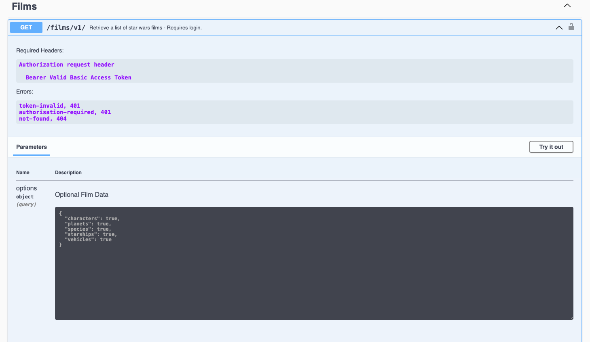

# starwars-api-backend-skeleton

---

### Backend API Learning Workflow:

---
### Stage-4:
<span style="color:#FF1B55FF">Adding Authentication</span>

#### Introduction: 

    In nearly all cases except for public endpoints, using the API will require authentication. That is - most requests made to the API must be made with a valid token in an 
    Authorisation header under Bearer.

    We shall develop our authentication process for users to be able to access certain endpoints of our API
    only when they have signed up and logged in. We'll be using JWT (Json Web Tokens) to handle the anatomy of our authentication process.

    Using a JWT package we shall create and manage the use of the required access tokens on behalf of each regular user or admin user. These tokens are generated and returned on Signup
    and Login and for email and password endpoints. They are then returned in the response body to the client who will need to store these tokens somewhere and pass them in the
    request header as described in API Requests.

Summary of objectives:

  * Develop a JWT based authentication code base 
  * Integrate it with our openAPI specification
  * Add authentication to some of our endpoints.

<details>
<summary style="color:#4ba9cc">Understanding JWT</summary>

 For a full introduction to JWT see:

[https://jwt.io/introduction/](https://jwt.io/introduction/)

---
##### A short Introduction to JWT

    JSON web token (JWT), pronounced "jot", is an open standard (RFC 7519) that defines a self-contained method
    for securely transmitting information between parties as a JSON (Javascript Object Notation) object.

    APIs use JWT to facilitate authentication between clients and the API backend. With JWT it is fairly straight forward to create different 
    tokens for different uses. For example, standard authentication, email renewal, password resets etc. etc.

    Because of its relatively small size, a JWT can be sent through a POST parameter or inside an HTTP header, and it is transmitted quickly. 
    A JWT contains all the required information about an entity to avoid querying a database on every access to the service in question.

    On receipt of a JWT there is no need to call a server to validate the token. The token can be easily validated and decoded.

    It is important to remember that JWT is a standard for creating tokens, thus all JWTs are tokens, but not all tokens are JWTs. 

##### Anatomy of a JWT

    A JWT token consists of three components, separated by comma (,) in the form
  
 	    header.payload.signature

 ##### JWT Header:

    The headers represent information (metadata) about the cryptographic algorithms used to encypt and decrypt the tokens
    
    The specified header should conform to:
```python
 {
    "alg": "HS256",
    "typ": "JWT"
    "iat": NumericDate value
 }
```
     where
    
         "alg" = the hashing algorithm to use for encoding/decoding
        
         "typ" = "JWT"

 ##### JWT Payload:

    The payload is the part where we use what are called claims.
    Claims are statements about some entity - i.e. Users. You can think of each claim as a key-value pair and the payload as a dictionary (in fact we will use a Python dictionary to represent it as we will see soon). For example, the subject claim has the "sub" key and a *string* id of the subject as the value (typically used to identify the session). 
 
    There are three types of claim, registered, public, and private.

    Although, not mandatory, registered claims add extra useful information to the payload.

    Registered Claims:

        1. sub (randomly generated id)
        2. iat (issued at time - Integer representing date of token creation in seconds)
        3. exp (expiration time - to be decided)
        4. iss (issuing party - who issued the token)
        others...

    Public Claims:

        These are claims that are public to everyone and might contain generic information. Public claim names
        should be registered at IANA JSON Web Token Claims Registry to avoid collisions with other public claims.
       
    
     Private Claims:
 
        Private claims are exactly that, private to the application in question. 
        Private claims are generally data containers - key value pairs.
        For example, 'user_id': user_id

##### JWT Signature:

    The signature component of all tokens is used to validate the token and ensure its authenticity and that it has not been tampered with. 
    
    It is composed as follows:

```python
 HMACSHA256(
    base64UrlEncode(header) + "." +
    base64UrlEncode(payload),
    secret_key
 )
```
    
##### Typical JWT:

    A typical token is an encoded representation of our claims and looks something like this:

        eyJ0eXAiOiJKV1QiLCJhbGciOiJIUzI1NiJ9.eyJpc3MiOiJmYXRoYXQub3JnIiwiZXhwIjoxNjQxOTE1MTU2LC
        JpYXQiOjE2NDE4NzkxNTYsInN1YiI6IjUzMDA5YTBiLTdhMjItNGZhMS1iYWExLWU4MWUyNjFhZGE2ZSIsImFjY
        2Vzc19yb2xlIjoiYmFzaWMiLCJ1c2VyX2lkIjoxMywic3RhbmRhcmRfY2xhaW0iOnRydWV9.A8Fg069Rv2wgNbs
        jbwMiaDLESWDlGxkevoBxThLbkeA
        
    This is the what is encoded and decoded by our JWT code in the application. Decoding this will reveal our claims
    that we can then read and retrieve data from, such as user id or email address or other data.

</details>

<details>
<summary style="color:#4ba9cc">Understanding the Authentication Flow</summary>

    An authentication flow in an API relates to the access of data or actions on that data that is allowed by any one endpoint. 
    For example, some endpoints that can 'Delete' or perform other administrative actions on data will require a different/higher 
    level of access. Endpoint access is of course related to user access, regardless of the users being people or systems.

    Applications can have a varying number of authentication levels. A Typical system might have a basic access and an admin access.
    Some systems, for example, may have restrictive access for free tiers of their service and a different access for
    paid tiers.

    Even different actions across a system by the same user may require different tokens. As mentioned previously, resetting emails and passwords
    is a good example of this.
    
    Generally, each level of authentication carries private payload claims specific to the task at hand.

    For example, a token that enables user access to an endpoint to reset their password might have a claim called resetPassword. The code in the server checks the claim and makes sure that the token can be used to authorize only the password change operations, not others. 
    Private claims are there to differentiate the tokens for both clients and services.

##### The typical flow of authentication for our API can be seen below


    At this level it is fairly straight forward. If an endpoint is secured, i.e. it needs authentication to access it then a token should be included in the request.

    The way things normally work is as follows:

    * A client will first sign-up to a service with a set of credentials (username and password)
    * After signup is complete the client will not yet have an access token, first they need to login
    * The client logs in to the system with the username and password used in the signup step, and if successful, receives their access token. The client stores the access token locally (eg. in the browser's storage) and it will need
      to send it for every request that wants to access a secured endpoint.

    How we apply security to our endpoints is two fold.

    1. By way of assigning a security declaration to the endpoints openAPI specification
    2. By checking the user permissions for that endpoint at the beginning of the endpoint code.

    Thus, no endpoint will even be reached if it requires authorisation and there is no appropriate token in the Api request from the client.
    The request generates an error response. But if there is a token and it is valid, the end point is reached and the permissions checked.
    
    Checking permissions is checking access roles (this is also called authorisation). It is important to remind ourselves once more that regardless of whether a token is sent from the client or from
    it must carry the correct claims for the appropriate access to the endpoint.

    
Look at the following login flow that we shall develop for our API.


    To sum it up:

    * A login request is made
    * If the user is signed up and not already logged in (you must ensure users logout before being able to login) then
      generate any user tokens and send them back along with any other data in the response. 

    Once a client has tokens it is responsible for storing those tokens somewhere, we'll get to that when we get to our Frontend.

</details>

<details>
<summary style="color:#4ba9cc">Our API Authentication Levels</summary>

There is one type of access role for our API

    1. Basic Access Role

    However, there will be several types of token. Each of these tokens shall have a unique private claim when generated. 
    Remember it is the private claim that enables us to identify the client and the type of token


##### 1. Basic Access Token

    This will allow us to login and access our secured endpoints

    Private claim:

```python
['user_id', 'standard_claim']
```

##### 2. Refresh Token

    This token is used to ask for new tokens after a basic access token expires or gets lost.
    This is the only token that is saved with client data in a database.

    Private claim:

```python
['user_id', 'refresh_claim']
```

##### 3. Email Token

    This token is used when verifying email addresses.

    Private claim:

```python
['user_id', 'email_claim']
```

##### 4. Password Token

    This token is used when a user wants to change their password.

    Private claim:

```python
['user_id', 'email_claim']
```
</details>

<details>
<summary style="color:#4ba9cc">Adding our configuration details</summary>

Now that we understand a little more about JWT and the way our authentication is going to work let's get some configuration 
in place. We'll do this by placing some basic configuration data in a file at config/v1/app_config.py. This file will hold all
of the applications configuration data. 

Configuration data is often placed in a config file which is imported into any file that requires some of the configuration data, such as database handlers, 
authentication handlers etc. etc.

Let's start with the way we are going to encrypt our tokens

##### Token Security

    All our tokens shall use HS256. 

    HS256. Hash-based Message Authentication Code (HMAC) is an algorithm that combines a certain payload with a secret
    using a cryptographic hash function like SHA-256. The result is a code that can be used to verify a message only if
    both the generating and verifying parties know the secret.

```python
# ---------------------------------------------------
# JWT Json Web Tokens
# ---------------------------------------------------
JWT_ISSUER = "fathat.org"
JWT_ALGORITHM = "HS256"
```

    The issuer is in this case us, well actually FatHat.org.
    The algorithm as can be seen is the HS256.

    ok, go ahead and copy the code directly above to the app_config.py file. We'll then add the secrects directly below.

#### Secrets
    The following are a bunch of secrets that have been pre-generated. The secrets below are in hexadecimal notation, so each is 32 digits * 4 = 128-bit long.

```python
# Default secret used to create all new access JWTs
JWT_SECRET = "0f8014e60a33413b8f1ef6c414a5ed86"

JWT_REFRESH_SECRET = "0f8014e60a33413b8f1ef6c414a7ab21"

# Default secret used to create all new email JWTs
JWT_EMAIL_SECRET = "0h1014e60a33313b8f1ef6c414a5ed19"

# Default secret for password utilities
JWT_PASSWORD_SECRET = "0f8014e60a33413b8f1ef6c414a1de15"
```

    We use the appropriate secret to match the kind of token we are generating.
    
    Copy the secrets to the config file

#### Payloads 


    The following is a set of private payload claims described previously. Our code will verify that the token sent from the client contains these claims in its payload.

```python
# ---------------------------------------------------

# Default claims payloads for standard tokens
JWT_BASIC_PAYLOAD_CLAIM = ['user_id', 'standard_claim']

# Default claims payload for email JWTs
JWT_EMAIL_PAYLOAD_CLAIM = ['user_id', 'email_claim']

# Default claims payload for email JWTs
JWT_PASSWORD_PAYLOAD_CLAIM = ['user_id', 'password_claim']

# Default claims payload for refresh JWTs
JWT_REFRESH_PAYLOAD_CLAIM = ['user_id', 'refresh_claim']

# --------------------------------------------------
```

    Go right ahead and append these claims into the config file.

#### Token Time To Live

    Here, we set default expiration times, in hours, for each type of token. When a token expires it should no longer be accepted by the API.
    We will discover how we do this when we write the code.

```python
# Number of hours a standard API usage token lasts
JWT_ACCESS_HOURS = 10

# Number of hours an API refresh token lasts
JWT_REFRESH_HOURS = 24 

# Number of hours an API password token lasts
JWT_PASSWORD_HOURS = 1

# Number of hours an API email token lasts
JWT_EMAIL_HOURS = 1

```
    Copy that data over to the app_config.py file and for now I think we're done with configuration, although we will be coming back later..

</details>

<details>
<summary style="color:#4ba9cc">Coding our authentication</summary>

Before we start coding a quick summary of how this works again including the role of the Python/Flask package 'connexion'
that we have already imported into our project in 'main.py'

Let's be clear. Our openAPi specification is a 'yaml' file. Yaml defined as a human-readable data-serialization language. The term yaml is said to originate from the term 'Yet another markup language'.
A yaml file cannot run on its own. It's not code, it's simply a way of describing something and has to be read by humans and computers to be understood.

This is where the package 'connexion' comes in, in conjunction with a few other packages that we do not directly import, such as packages for handling swagger user interfaces...

Let's look at the diagram below and see how our openApi spec, connexion, our authentication code and our endpoints join together.


As can be seen, connexion is our API gate-keeper. It does all the checks against the openAPI spec and handles the http requests and responses from the client.

There are numerous ways we can start writing the code for our authentication method. But to keep this simple we will start with the basic authentication endpoint
called by connexion. 

```python
# -*- coding: utf-8 -*-

# ------------------------------
#  External Imports
# ------------------------------

# ------------------------------
#  Python Imports
# ------------------------------

# ------------------------------
#  Module Imports
# ------------------------------
from auth.core import *
from config.v1.app_config import JWT_SECRET
from errors.v1.handlers import ApiError


def decode_token(token: str) -> dict:
    """
        Standard Token decode function only.
        If we have a token and the token is not in cache - grab the payload
        Called directly via the openapi spec under  x-bearerInfoFunc: auth.endpoints.decode_token

    :param token:
    :return:
    """
    if is_revoked(token):
        raise ApiError('token-invalid', status_code=401)
    else:
        payload = decode_auth_token(token, JWT_SECRET)
        return payload

```

    The 'decode' token function takes the token passed by 'connexion' and performs two tasks:

    * It calls the is_revoked function to check if the token has been revoked for some reason. Revoking basically means invalidating the token, marking the token not usable any more. If it has it'll raise an API error.
    * If the token has not been revoked it retrieves the payload from the token via decode_auth_token and returns it to 'connexion'.
      There are a couple of caveats handled in the function too. These are token expiration and invalidaty, both of which will raise
      errors.

    We will see each of these functions soon.

    Notice that we are using our configuration data by importing the JWT_SECRET from our config file. This is passed to the decode function
    so that it knows what secrect to use for decoding.

    Copy the code to auth/endpoints.py

Now let's move on to our core authentication code.

We'll start from literally from the top.

```python
# -*- coding: utf-8 -*-

# ----------------------------
#  Python Imports
# ----------------------------
import datetime
import uuid
import sys
import os

# ----------------------------
#  External Imports
# ----------------------------
import jwt

# ----------------------------
#  Module Imports
# ----------------------------
from auth.schemas import access_roles

# ----------------------------
#  Module Imports
# ----------------------------
from errors.v1.handlers import ApiError
from config.v1.app_config import JWT_SECRET, JWT_EMAIL_SECRET, JWT_REFRESH_SECRET, JWT_PASSWORD_SECRET, JWT_BASIC_PAYLOAD_CLAIM, \
    JWT_EMAIL_PAYLOAD_CLAIM, JWT_PASSWORD_PAYLOAD_CLAIM, JWT_REFRESH_PAYLOAD_CLAIM, JWT_ISSUER, JWT_ALGORITHM, \
    JWT_ACCESS_HOURS, JWT_REFRESH_HOURS, JWT_EMAIL_HOURS, JWT_PASSWORD_HOURS
from database.redis.rd_utils import redis_connection

# ----------------------------
#  path settings
# ----------------------------
module_path = os.path.abspath(os.getcwd())

if module_path not in sys.path:
    sys.path.append(module_path)

```

    The head of the file as usual is importing all the various packages, modules and utilities that we require. Notice
    all the configuration data being imported. 

    We're also importing our valid access roles. These are not imported from the config, although they could be, they are imported from a
    file called schemas.py in the same folder as all our other auth code.

```python
from auth.schemas import access_roles
```

    So while we are here let's add our schemas

    Add the following code to auth/schemas.py

```python
def access_roles() -> dict:
    """
        Access Roles - The integer defines order and accessibility in a minimum roles scheme
    """
    return {'basic': 1, 'admin': 2}
```
    The function access_roles returns a simple dictionary with two key-value pairs.

    As you can see the 'basic' has a value of 1 and 'admin' is 2. What this implies is that basic is less than admin.
    Doing this allows us to set a minimum access priviledge to our endpoints. For example, if we set the priviledge level of an endpoint as `basic` (1), roles with the same or higher number (including `admin`) can access itl if we set the level of an endpoint as `admin` (2), the `basic` role cannot access it as its level (1) is lower. In this way, we can implement the priviledge check as a simple integer comparison. It's not as visibile with just two roles but imagine
    there are numerous access roles ranging with values from 1 to n. If an endpoint requires an access role called for example, 
    'premium' then any access role with a value higher than 'premium' could also access that endpoint. 

    In short this allows a stepped authorisation system.

    
    There is one other line in the imports that is worthy of particular attention as it indicates an area we haven't covered yet,
    but will later. 

```python
from database.redis.rd_utils import redis_connection
```

    This line tells us that we are using the 'Redis' nosql database. As will be shown, we use 'Redis' to store our
    invalid tokens. We check our incoming tokens against those contained in the database each time we receive a request.
    
    'Redis', is an in memory database so it's very fast. We'll cover 'Redis' and how we access it in the next section.

ok, let's move on to our first and primary function in our code. The function that creates the Tokens

<!-- TODO: Move this before the decode_token function, to start with generating the token and then move to verifying the token -->

```python
# ----------------------------
#  Functions
# ----------------------------

def generate_jwt(**kwargs: dict) -> str:
    """
        Generate a JWT for api call usage

    :param kwargs: must contain access_role and user_id
    :return: token
    :errors:
        'invalid-payload_CLAIM_argument' 401
        'problem-creating-token' 401
        'user-not-found' 401
        'token-generation-failure' 401
    """

    def gen_token(**kwargs: dict) -> str:
        """
            Generates a payload
            
        :param kwargs:
        :return: usage payload
        """
        payload = {}

        try:

            # payload_claim states the kind of claim i.e. standard_claim, refresh_claim, email_claim, password_claim etc
            if kwargs.get('payload_claim') and isinstance(kwargs['payload_claim'], dict):

                claims = kwargs['payload_claim']

                if kwargs.get('hours'):
                    hours = kwargs.get('hours')
                elif claims.get('standard_claim'):
                    hours = JWT_ACCESS_HOURS
                elif claims.get('refresh_claim'):
                    hours = JWT_REFRESH_HOURS
                elif claims.get('email_claim'):
                    hours = JWT_EMAIL_HOURS
                elif claims.get('password_claim'):
                    hours = JWT_PASSWORD_HOURS
                else:
                    raise Exception

                payload.update(kwargs['payload_claim'])

            else:
                raise ApiError('invalid-payload_claim', status_code=401)

            # Add some registered claims and our own private claims for user_id and access_role.
            payload.update({
                'iss': JWT_ISSUER,
                'exp': datetime.datetime.utcnow() + datetime.timedelta(hours=hours),
                'iat': datetime.datetime.utcnow(),
                'sub': str(uuid.uuid4()),
                'access_role': kwargs['access_role'],
                'user_id': kwargs['user_id']
            })

            # get the secret
            if select_secret(payload):
                # Encode the token
                token = jwt.encode(
                    payload,
                    select_secret(payload),
                    algorithm=JWT_ALGORITHM)

                return token
            else:
                raise ApiError('problem-creating-token', status_code=401)

        except Exception as e:
            raise ApiError('token-generation-failure', status_code=401)

    if kwargs['user_id'] and kwargs['access_role']:

        token = gen_token(**kwargs)
        return token
    else:
        raise ApiError('user-not-found', status_code=401)
```

    generate_jwt does exactly what is say on the tin through a number of steps:
    
    * Checks that there are private claims in the kwargs (keywords arguments), i.e. user_id or access_role
    * Calls the function gen_token

    gen_token does the following:

        * Creates an empty dictionary called payload.
        * Checks for the kwargs  argument called 'payload_claim'
        * Checks for another argument called 'hours'. This is an optional argument if the caller would like
          to overide the default Time to Live value of the token. If not it uses the payload_claim argument to get 
          the default hours for that particular token type.
        * Adds this data to the payload dictionary declared above
        * Adds the resgistered claims and our private claims.
        * Creates the token using a specific token secret and our JWT_ALGORITHM for signing (encryption and decryption)
          and then returns the token to the caller.

    Api Errors are raised when:

    * There is no payload_claims argument
    * There is no user_id or access_role specified
    * There is a problem when creating the token
    * Any other exception that may occur.

    A list of the errors raised is referenced in the Doc String.

    That's it, our primary function is complete.
    
    Append the code to auth/core.py

Next Function - decode_auth_token

```python
def decode_auth_token(token: str, secret: str) -> dict:
    """
    Decodes the auth token
    :param secret:
    :param token:
    :return: returns the payload of the decoded JWT
    :errors:
        'token-expired' 401
        'token-invalid' 401
    """
    try:
        return jwt.decode(token, secret, algorithms=[JWT_ALGORITHM])
    except jwt.ExpiredSignatureError:
        raise ApiError('token-expired', status_code=401)
    except jwt.InvalidTokenError:
        raise ApiError('token-invalid', status_code=401)
```

    This is simple function that is called to decode (decrypt) our token and reveal the payload.
    It calls the 'jwt' package function, jwt.decode to decode the token. The decypted payload is what is returned.

    It also uses the 'jwt' exceptions jwt.ExpiredSignatureError and jwt.InvalidTokenError to raise when
    either the token ahas expired or is invalid.

    Append the code to auth/core.py

Next Function - has_expired 

```python
def has_expired(token: str, secret: str):
    """
        Helper function to test if a token has expired without raising an ApiError

    :param token:
    :param secret:
    :return:
    """
    try:
        jwt.decode(token, secret, algorithms=['HS256'])
        return False
    except jwt.ExpiredSignatureError:
        return True
```

    This is a helper function used if needed to check if a token has expired. Currently it is not used in our application,
    but worthy of inclusion.

    Again it attempts to decode the token, returning False if it can (suggests it has not expired) and True if it cannot.

    Append the code to auth/core.py

More Helper Functions

```python
def decode_access_token(token: str):
    """
        Decodes an access token
    :param token:
    :return: returns the payload of the decoded access JWT
    :errors: See decode_auth_token
    """
    return decode_auth_token(token, JWT_SECRET)


def decode_email_token(token: str):
    """
        Decodes an email token

    :param token:
    :return: returns the payload of the decoded email JWT
    :errors: See decode_auth_token

    """
    return decode_auth_token(token, JWT_EMAIL_SECRET)


def decode_password_token(token: str):
    """
        Decodes a password token

    :param token:
    :return: returns the payload of the decoded password JWT
    :errors: See decode_auth_token

    """
    return decode_auth_token(token, JWT_PASSWORD_SECRET)
```

    The above functions can be used by code instead of the decode_auth_token function when you do not want to
    import the Secrets across a range of python files.

    Append the code to auth/core.py

Next Functions - Revocation

```python
def revoke_auth_token(token: str):
    """
        This could be used when a user logs out.
        Save a token to redis cache.
        TODO: We need a cron job to clear out expired tokens

    :param cid: Client ID
    :param token:
    :return:
    """
    redis_connection.set(token)


def is_revoked(token: str) -> bool:
    """

        Checks Redis cache for a revoked token. The issue here is when Redis cache fails...without a model we can't back this up.
        If we have a model then we will hit it for every single current non-revoked token, so a lot.
        If we have short-lived tokens we would not require this. However, we cannot expect users to login every 5 minutes so we would need to use a refresh token
        to allow generation of a new access token. The refresh token would then need to be refreshed itself after users.

        We would require a cron job to clear this out on a regular basis.

    :param cid: Client ID
    :param token: Client token
    :return: True if revoked or False
    """
    if redis_connection.get(token):
        return True
    return False
```

    The first function above 'revoke_auth_token' is used to revoke a token by sending the token to a 'Redis' database handler called set.
    You'll see how this works later.

    The second function 'is_revoked' checks the 'Redis' database for the function using a 'get' function. Again, we'll ge tto this later.

    Append the code to auth/core.py

Next Function - verify_payload

```python
def verify_payload(payload: dict, access_role: str) -> bool:
    """
        Verify the payload against the payload claims - making sure all is present and correct

    :param payload:
    :param access_role:
    :return: True
    :errors:
        'authorisation-required' 401
        'token-invalid' 401
    """
    if payload:
        # Check if all claims are present in payload keys
        # Raise an error

        if 'standard_claim' in payload:
            claims = JWT_BASIC_PAYLOAD_CLAIM
        elif 'email_claim' in payload:
            claims = JWT_EMAIL_PAYLOAD_CLAIM
        elif 'password_claim' in payload:
            claims = JWT_PASSWORD_PAYLOAD_CLAIM
        elif 'refresh_claim' in payload:
            claims = JWT_REFRESH_PAYLOAD_CLAIM
        else:
            raise ApiError('token-invalid', status_code=401)

        if len(set(claims) - set(payload.keys())):
            raise ApiError('token-invalid', status_code=401)

        # Check that the payload from the token has the minimum_role required
        roles = access_roles()
        if roles[payload['access_role']] < roles[access_role]:
            raise ApiError('authorisation-required', status_code=401)

        return True
    else:
        raise ApiError('token-invalid', status_code=401)
```

    This function has two parameters: a decypted payload and an access_role.
    It is primarily used as a function to secure endpoints via the function 'permissions',
    which in turn is called as the first line of code in our secured endpoints.
    
    This is waht it does:

    * Assigns the appropriate claim from the payload
    * Checks via a set (set offers uniquness) function that all claims in the appropriate claim match the claims in the payload.
    * Checks the payload access role aginst the access_role parameter, which is the minumum access role 
      required to access the endpoint.

    Exceptions are raised when
    
        * There is no payload
        * The claims are illegitimate
        * If the access role parameter has a lesser value than the required access role

    Append the code to auth/core.py

Next Function - verify_email_token

```python
def verify_email_token(token: str):
    """
        Verifies an email JWT token
    :param token:
    :returns: Token payload dictionary
    """
    if not is_revoked(token):
        payload = decode_auth_token(token, JWT_EMAIL_SECRET)
        verify_payload(payload, payload["access_role"])

        return payload

    return False
```
    Verifies an email function by:
        
        * Checking that the token is not revoked
        * Decypting the token into a payload
        * Veifying the paylaod. 

    Exceptions occur only in the called functions.

    Append the code to auth/core.py

Next Function - select_secret

```python
def select_secret(payload: dict) -> str | bool:
    """
        Returns a specific secret based on the contents of payload

    :param payload:
    :return:  secret or False
    """
    if payload.get('email_claim'):
        return JWT_EMAIL_SECRET
    elif payload.get('password_claim'):
        return JWT_PASSWORD_SECRET
    elif payload.get('refresh_claim'):
        return JWT_REFRESH_SECRET
    elif payload.get('standard_claim'):
        return JWT_SECRET

    return False
```

    Another straight forward helper function for matching a secret against a claim and returning it.
    If no scret matches it returns False

    Append the code to auth/core.py

Next Function - permissions

<-- TODO: Move this to the end to the "Adding authentication checks to our endpoints" section -->

```python
def permission(payload: dict, access_role: str, logout=False) -> bool:
    """
        Called from our endpoints prior to code access.

    :param payload: token_info passed via the endpoint:
    :param access_role: The access role of the client attempting access
    :param logout: If True then client is logging out
    :return: Boolean - True
    """
    verify_payload(payload, access_role)

    if logout:
        revoke_auth_token(payload['token'])

    return True
```

    'permissions' has three parameters:

    * payload: token_info passed via the endpoint
    * access_role: the required access role to run the endpoint code after this checks
    * logout: set by default to False

    Again, straight forward, verifies payload and if logout is True, which means it is called via the logout endpoint,
    then revoke the token via 'revoke_auth_token'

    Append the code to auth/core.py

Ok, that's our core code done with. Take your time to go over and review everything that is going on before moving on to the next
section.

</details>

<details>
<summary style="color:#4ba9cc">Adding the Redis database utilities for tokens</summary>

We are going to add nour redis database code for saving and fetching all tokens that have been revoked.

We have already installed our Redis database during the setup process of this project. Now we shall add the required functionality:


#### Imports

```python
# ------------------------------------------------
#    External imports
# ------------------------------------------------
import redis
from redis import ResponseError, ConnectionError

# ------------------------------------------------
#    Python Imports
# ------------------------------------------------
import logging

# ------------------------------------------------
#    Module Imports
# ------------------------------------------------
from errors.v1.handlers import ApiError
from config.v1.app_config import REDIS


```
    The imports above import everything we need to handle our redis database.
    
    Copy this code into database/redis/rd_utils.py

Now let's look at the core 'Redis' class RedisConnect
```python

# ------------------------------------------------
#    Redis Class
# ------------------------------------------------

class RedisConnect(object):
    """
        Connects to our Redis database

    :return:
    """
    
    def __init__(self):
        self.connect_data = REDIS
        try:
            self.connection = redis.Redis(REDIS['host'], REDIS['port'], REDIS['db'], REDIS['password'])
            self.check_connection()
        except redis.AuthenticationError:
            # We could use an HTTP error status code of 500 or 503
            logging.error("Redis Authentication Error %s" % self.connect_data['db'], exc_info=True)
            raise ApiError(message="service unavailable", status_code=503)

    def check_connection(self):
        try:
            self.connection.randomkey()
            logging.info("Connected to Redis[db:%s] on %s:%s" % (self.connect_data['db'], self.connect_data['host'], self.connect_data['port']), exc_info=False)
        except ConnectionError as e:
            logging.error("Cannot connect to Redis[db:%s] on %s:%s" % (self.connect_data['db'], self.connect_data['host'], self.connect_data['port']), exc_info=False)
            
    def bgsave(self):
        """
            Asynchronously save the Redis db on disk
            In the case of an error during saving - Do not cause an exception - just log
        """
        if self.connection.bgsave():
            logging.info("Redis[db:%s] saved successfully" % self.connect_data['db'], exc_info=False)
        else:
            logging.error("Redis[db:%s] was NOT saved successfully" % self.connect_data['db'], exc_info=True)

    def set(self, k):
        """
            Save a Key/Value pair to the Redis cache
        :return:
        """

        try:
            self.connection.set(k, 1)
            self.bgsave()
        except ResponseError as e:
            logging.error("Redis did not save the key %s" % k, exc_info=True)
            raise ApiError(message="service unavailable", status_code=503)

    def get(self, k):
        """
            Return a Key/Value pair from the Redis cache where the k is a name
        :
        :return:
        """
        try:
            return self.connection.get(k)
        except Exception:
            raise ApiError(message="service unavailable", status_code=503)


# This is a pointer to the class RedisConnect above and can be imported by modules
# using - from database.redis.rd_utils import redis_connection
redis_connection = RedisConnect()

```

    This class holds all the helper functions for connecting to our 'Redis' database, saving and fetching revoked tokens.

The initialisation function - __init__

    This method takes our database configuration data from the config/app_config file aka imports above, and attempts a
    connection with our redis database.

    Note: The redis database should be running at this point.

    If successful it calls the class method 'check_connection' just to make sure we have access. If this fails we log an error,
    but do not raise an API Exception. We obviously need to check what is blocking the connection here, and our attention shall
    be focused if an exception occurs when we attempt access to the database.

    If it cannot connect at all we do raise an exception.
    
Next Function - bgsave

    This is a helper function that simply save the redis data to the disk in a background task. Redis automatically does this
    from time to time, but for extra consistency we shall call this function everytime we save a token.

Next Function - set

    This function is what we call when we are revoking a token from our authentication code.

    It takes a key 'k' as a parameter. In our API that key is the token we want to save. We then save this key with a value of 1. 
    We could use any value here as we are only really interested int he token key, but because redis requires a value for a key 
    a binary 1 (True) seems appropriate.

    If 'Redis' is running ok the token will get saved, if it is not we raise an exception.

Next Function - get 

    This again takes the token as a parameter key 'k' and tries to get that key from the database.
    If 'Redis' is running ok it returns True or False, if it is not we raise an exception.

That's it for the class methods.

The one last declaration we need is to define the variable 'redis_connection' and assign it a RedisConnect class instance.
We do this outside of the class as we don't really want to instantiate a new class whenever we need access to our redis database.

```python
redis_connection = RedisConnect()
```

    As usual, make sure you have copied all of the code above to the file database/redis/rd_utils.py
    That's a wrap on our 'Redis' database functionality.

</details>

<details>
<summary style="color:#4ba9cc">Adding our security specification to our openAPI</summary>

    Before we can make use of our authentication we need to add a few details to our openAPI specification
    in our openap.yaml file, under 'components' before 'schemas.

```yaml
  securitySchemes:
    jwt:
      type: http
      scheme: bearer
      bearerFormat: JWT
      x-bearerInfoFunc: auth.endpoints.decode_token
```

    This is our openAPI security schema. It is appropriatesly named jwt and as you can see it specifies that we are using JWT as the bearerFormat, 
    and points to a functionto call to pass the token to, i.e. 'auth.endpoints.decode_token'. Remember that 'connexion' will retrieve
    this schema and understand that it is a JWT authentication schema, will then take the token passed in the request and pass it to the function.

    Notice also the 'type'. Here we are stating http as we will not be using any TLS (Transport Layer Security) for our project as it is deployed on our local machines.
    However, if we want to move this project to a server we would use TLS and change the 'type' to https.

    Now that we have our security schema we can mark enpoints that we require authentication for.

    As an example let's mark our 'films' endpoint - /films/v1/ as requiring security. 

    All we have to do is add the following below the endpoint specification:

```yaml
security:
  - jwt: []
```

    so we end up with this:

```yaml
 /films/v1/:

    get:
      summary: Retrieve a list of star wars films - Requires login.
      tags:
        - Films
      description: >

        Required Headers:

            Authorization request header

              Bearer Valid Admin Access Token

        Errors:

            token-invalid, 401
            authorisation-required, 401
            not-found, 404

      operationId: films.v1.endpoints.get_films
      parameters:
        - name: "options"
          in: query
          description: Optional Film Data
          required: false
          style: deepObject
          schema:
            $ref: '#/components/schemas/FilmExtras'

      responses:
        '200':
          description: Returns a data object containing a list of Film entities
          content:
            application/json:
              schema:
                $ref: '#/components/schemas/FilmListResponse'

      security:
        - jwt: []
```

    It's as simple as that, we just mark any endpoint that we want authentication for.
    
    Copy this security specification to the 'components' part of the openAPi specification.

</details>

<details>
<summary style="color:#4ba9cc">Adding authorisation checks to our endpoints</summary>

    At this point, we have code to generate (and sign) a token and verify the token and obtain the claims in it.
    The changes in the yaml file above will ensure that each endpoint will be called *only if* the token in the request is verified. But this is not enough, we also need to make sure the user can access only the endpoints it is allowed to access.

    Finally, we need to add some form of authorisation control to the endpoints to check access roles.
    Let's use our 'get_films' endpoint to show how this is done:

```python

def get_films(**kwargs):
    """
        Fetch all the films via pagination. If there is a cursor then fetch the next batch of films

    :param kwargs: dictionary object containing keyword arguments
    :return: List of Film Entities and total film count
    :errors:
    """
    permission(kwargs['token_info'], access_role='basic')
    films, count = FilmDacc.films(kwargs['options'])

    if films:
        return api_response({
            'results': films,
            'count': count
        })
    else:
        raise ApiError('films-not-found', status_code=404)
```

    You already have this endpoint in films/v1/endpoints.py. However, there is one line missing:

```python
permission(kwargs['token_info'], access_role='basic')
```

    This is the function that is called before any code on an authenticated endpoint.
    You should remember this from earlier when coding the JWT core functionality. Also, you should recall how the 'token_info'
    data arrives in the kwargs (keyword arguments). That's right, 'connexion'!

    Copy the following the line and place it as in the code above, so it is the first line that executes in the endppoint.
    
    Now copy import line for this function and place it under 'Module Imports' in the same file.

```python
from auth.core import permission
```

    To summarise this function verifies the paylaod and checks the access role required for the endpoint, which as you can see is clearly stated above as 'basic' 
    and compares it to the access role contained in the payload. 

    We'll be using this function more when it comes to our 'users'

    That's a wrap for our authentication section. Take your time to go over what we have done and ensure a comprehensive 
    understanding.

</details>

<details>
<summary style="color:#ffc300">Testing</summary>

Ok, so let's run the application and go to our API page in the browser, making sure we refresh it.

You will see the following:



    Notice the unlocked padlock to the far right of the endpoint head. This states that we require some form of authentication to use this endpoint.

    Click 'Try it out' and then execute and see what happens.


    As you can see because we haven't input a token, it's telling us there was a 401 Error  - UNAUTHORISED. And in the response it tells us that
    'No authorization token provided'

    With our authentication and authorisation now firrmly in place we can move on to our final stage of adding users and start to generate
    tokens and see how it really works.

</details>

[<span style="color:#4ba9cc">Stage 5 - Introducing Users</span>](users.md)
