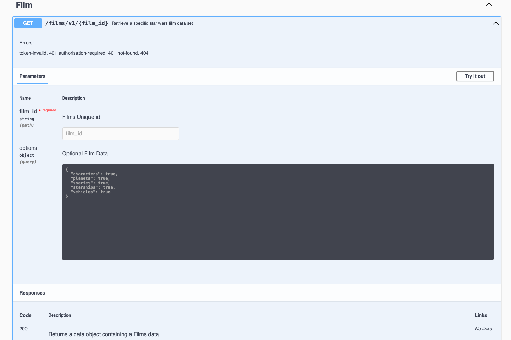

# starwars-api-backend-skeleton

---

### Backend API Learning Workflow:

---
### Stage 1: 
<span style="color:#FF1B55FF">API Foundation - app, endpoint - Api specification</span>

#### Description: 
    Getting Flask running and creating our first API call, defining the required OpenApi Yaml configuration for it.
    Connecting that to our endpoint and finally running it.

<details>

<summary style="color:#4ba9cc">1. Get flask running</summary>
  
    Copy the following code and place it in main.py in the root folder. 

```python


# -*- coding: utf-8 -*-

# -------------------------------------------------
#  External Imports
# -------------------------------------------------
from flask import Flask

# -------------------------------------------------
#  Python Imports
# -------------------------------------------------

# -------------------------------------------------
#  Module Imports
# -------------------------------------------------

# -------------------------------------------------
#  Setup
# -------------------------------------------------

app = Flask(__name__)


if __name__ == '__main__':
   app.run()

```
   
    This provides a basic flask application that runs but does nothing. Try running main.py now.
   
    What we have is a running flask app on port 5000, as can be seen below:

```python
   * Serving Flask app "main" (lazy loading)
   * Environment: production
     WARNING: This is a development server. Do not use it in a production deployment.
     Use a production WSGI server instead.
   * Debug mode: off
   * Running on http://127.0.0.1:5000/ (Press CTRL+C to quit)
```

    If you click on the [http://127.0.0.1:5000/](http://127.0.0.1:5000/) you will go to the browser but all you'll get is a not found page.
    This is because the Flask app is simply running on a port on localhost but not pointing to anything. 

</details>

<details>
<summary style="color:#4ba9cc">2. Add our first endpoint for the API</summary> 

    Our first endpoint is a films endpoint
   
    Navigate to the films/v1/folder and copy the following code and append it to endpoints.py

```python
# -*- coding: utf-8 -*-

# ------------------------------------------------
#    External imports
# ------------------------------------------------

# ------------------------------------------------
#    Python Imports
# ------------------------------------------------

# ------------------------------------------------
#    Module Imports
# ------------------------------------------------

# ------------------------------------------------
#    Films Data Access layer
# ------------------------------------------------


# ------------------------------------------------
#          FILM REST FUNCTIONS START HERE
# ------------------------------------------------
def get_film(film_id, **kwargs):
    """
        Fetch a film's entity from its name
    :param film_id: The id of the film to be retrieved
    :return: Film Entity
    :errors:
        raises an APIError
    """
    pass
```
   
    This is the basic python function for our first films endpoint.

    Now copy the following openAPi yaml markup to the openapi.yaml file in the root folder.

```yaml
openapi: 3.0.0

info:
  title: "{{title}}"
  version: "1.0.0"


# Avoid having a definitive base path here. Set the path in the actual paths - facilitate versions
# Example v1.0.0/login and v1.0.2 can both be specified

servers:
  - url: http://127.0.0.1:5003/
    description: relative path example

paths:

  # -----------------------------------------------
  # Film paths - REQUESTS
  # -----------------------------------------------

  /films/v1/{film_id}:

    get:
      summary: Retrieve a specific star wars film data set
      tags:
        - Film
      description: >
        
        Errors:

          token-invalid, 401
          authorisation-required, 401
          not-found, 404

      operationId: films.v1.endpoints.get_film
      parameters:
        - name: "film_id"
          description: Films Unique id
          in: path
          required: true
          schema:
            type: string
        - name: "options"
          in: query
          description: Optional Film Data
          required: false
          style: deepObject
          schema:
            $ref: '#/components/schemas/FilmExtras'
      responses:
        '200':
          description: Returns a data object containing a Films data
          content:
            application/json:
              schema:
                $ref: '#/components/schemas/FilmResponse'

# -----------------------------------------------
# COMPONENTS
# -----------------------------------------------
components:


  # -----------------------------------------------
  # SCHEMAS
  # -----------------------------------------------
  schemas:

    # -----------------------------------------------
    #  FILM SCHEMAS
    # -----------------------------------------------

    # -----------------------------------------------
    #  Film DATA SCHEMAS
    # -----------------------------------------------

    BaseFilm:
      properties:
        title:
          description: Film's Title
          type: string
        episode_id:
          description: Films id representing it's order of creation
          type: string
        opening_crawl:
          description: Films opening text
        director:
          description: Film Director
        producer:
          description: Film Producer
          type: string
        release_date:
          description: Date the film was released in to Cinemas
          type: string
        created:
          description: Date when record of this film was created in the database
          type: string
        edited:
          description: Date when record of this film was last edited in the database
          type: string
        url:
          description: The URL of the film
          type: string

    FilmCharacters:
      properties:
        characters:
          description: List of urls for characters in the film
          type: array
          items:
            type: string

    FilmVehicles:
      properties:
        vehicles:
          description: List of urls for vehicles in the film
          type: array
          items:
            type: string

    FilmStarships:
      properties:
        starships:
          description: List of urls for starships used in the film
          type: array
          items:
            type: string

    FilmPlanets:
      properties:
        planets:
          description: List of urls for planets in the film
          type: array
          items:
            type: string

    FilmSpecies:
      properties:
        species:
          description: List of urls for the different species of characters in the film
          type: array
          items:
            type: string

    # -----------------------------------------------
    #  Film Extras REQUEST SCHEMA
    # -----------------------------------------------
    FilmExtras:
      type: object
      properties:
        characters:
          description: provide film character urls
          type: boolean
        planets:
          description: provide all film planet urls
          type: boolean
        species:
          description: provide all film species urls
          type: boolean
        starships:
          description: provide all film starship urls
          type: boolean
        vehicles:
          description: provide all film vehicle urls
          type: boolean

    # -----------------------------------------------
    #  Film RESPONSE SCHEMAS
    # -----------------------------------------------

    FilmResponse:
      allOf:
        - $ref: '#/components/schemas/BaseFilm'
      anyOf:
        - $ref: '#/components/schemas/FilmCharacters'
        - $ref: '#/components/schemas/FilmPlanets'
        - $ref: '#/components/schemas/FilmSpecies'
        - $ref: '#/components/schemas/FilmStarships'
        - $ref: '#/components/schemas/FilmVehicles'

```
    Now we have our first Request, Response and Schema definitions for our first API call to get a films data via the films endpoint, but no way of connecting the two together. 
    However, before we move on to fixing that let's take a good long look at what we've just placed in our openapi.yaml file.

    starting with an initial declaration below:

```yaml
openapi: 3.0.0

info:
  title: "{{title}}"
  version: "1.0.0"
```
    We ->
    * Declare the openapi version - 3.0.0
    * Set the title as a variable to be passed in via our code on startup
    * Declared the version of our API - 1.0.0

    Next we define our servers. 

```yaml
servers:
  - url: http://127.0.0.1:5003/
    description: relative path example
```
    Currently we have a single server but it is possible to define more than one server.
    Please refer to the openAPI documentation at 

[Servers](https://spec.openapis.org/oas/v3.1.0#server-object)
    
    Moving on to our paths. Paths specify the actual request url paths to our API endpoints and the construction of those
    requests vis-à-vis any parameters we need to include and where those parameters are contained within the request, i.e. path, query or body.
    They also define the API response for the endpoint.

    The positioning of parameters in requests all depends on the type of request, i.e. 'GET', 'POST' etc. etc.
    
    For now it is important to remember that for every endpoint there must be a path.

    As you can see below we have a single path to our endpoint 'films.v1.endpoints.get_film'. 

```yaml
/films/v1/{film_id}:

    get:
      summary: Retrieve a specific star wars film data set
      tags:
        - Film
      description: >
        
        Errors:

          token-invalid, 401
          authorisation-required, 401
          not-found, 404

      operationId: films.v1.endpoints.get_film
      parameters:
        - name: "film_id"
          description: Films Unique id
          in: path
          required: true
          schema:
            type: string
        - name: "options"
          in: query
          description: Optional Film Data
          required: false
          style: deepObject
          schema:
            $ref: '#/components/schemas/FilmExtras'
      responses:
        '200':
          description: Returns a data object containing a Films data
          content:
            application/json:
              schema:
                $ref: '#/components/schemas/FilmResponse'

```

    This is a 'GET' request meaning it is only requesting data and not passing any data to save. 
    In 'GET' requests we can pass data via the 'path' of the url or as a query, i.e. after the 
    the path using a '?' symbol to indicate the beginning of the query data.

    In this particular request we are passing the film id as part of the path:

```yaml
/films/v1/{film_id}:
```

    The curly braces indicate a parameter in the path. We are also passing a parameter called 'options', but this is in the query. We'll get to what that looks like shortly.
    You can see how these are defined in the specification above.

    However, before we define our parameters we define our 'operationId'. This is what tells us where the endpoint in our code lives.

```yaml
 operationId: films.v1.endpoints.get_film
```

    The full path from our specification file is defined here, but instead of using '/' we use '.' to separate the path

    The last part of our request specification is the responses. The reponses declaration defines what to include for each response
    type. 

```yaml
responses:
    '200':
      description: Returns a data object containing a Films data
      content:
        application/json:
          schema:
            $ref: '#/components/schemas/FilmResponse'
```
    Because we define our own API error handling we are just dealing with a successful http response '200' here.
    What the response contains is defined in a schema called FilmResponse. We'll get to schemas shortly.

Next up is our 'components' section.

    The 'components' section defines a set of resuable objects that may or may not be used by our request and response specifications.

    Again, study the documentation at the following link for a full overview of 'components'

[Components](https://spec.openapis.org/oas/v3.1.0#components-object)

    What is important for us is the 'Schemas' section of 'components'. This is where we shall define our request and response schemas. 
    In other words we shall define the data structure of our query parameters in our requests and the structure of our responeses and 
    what data they should contain.

```yaml
# -----------------------------------------------
# COMPONENTS
# -----------------------------------------------
components:


  # -----------------------------------------------
  # SCHEMAS
  # -----------------------------------------------
  schemas:

    # -----------------------------------------------
    #  FILM SCHEMAS
    # -----------------------------------------------

    # -----------------------------------------------
    #  Film DATA SCHEMAS
    # -----------------------------------------------

    BaseFilm:
      properties:
        title:
          description: Film's Title
          type: string
        episode_id:
          description: Films id representing it's order of creation
          type: string
        opening_crawl:
          description: Films opening text
        director:
          description: Film Director
        producer:
          description: Film Producer
          type: string
        release_date:
          description: Date the film was released in to Cinemas
          type: string
        created:
          description: Date when record of this film was created in the database
          type: string
        edited:
          description: Date when record of this film was last edited in the database
          type: string
        url:
          description: The URL of the film
          type: string

    FilmCharacters:
      properties:
        characters:
          description: List of urls for characters in the film
          type: array
          items:
            type: string

    FilmVehicles:
      properties:
        vehicles:
          description: List of urls for vehicles in the film
          type: array
          items:
            type: string

    FilmStarships:
      properties:
        starships:
          description: List of urls for starships used in the film
          type: array
          items:
            type: string

    FilmPlanets:
      properties:
        planets:
          description: List of urls for planets in the film
          type: array
          items:
            type: string

    FilmSpecies:
      properties:
        species:
          description: List of urls for the different species of characters in the film
          type: array
          items:
            type: string

    # -----------------------------------------------
    #  Film Extras REQUEST SCHEMA
    # -----------------------------------------------
    FilmExtras:
      type: object
      properties:
        characters:
          description: provide film character urls
          type: boolean
        planets:
          description: provide all film planet urls
          type: boolean
        species:
          description: provide all film species urls
          type: boolean
        starships:
          description: provide all film starship urls
          type: boolean
        vehicles:
          description: provide all film vehicle urls
          type: boolean

    # -----------------------------------------------
    #  Film RESPONSE SCHEMAS
    # -----------------------------------------------

    FilmResponse:
      allOf:
        - $ref: '#/components/schemas/BaseFilm'
      anyOf:
        - $ref: '#/components/schemas/FilmCharacters'
        - $ref: '#/components/schemas/FilmPlanets'
        - $ref: '#/components/schemas/FilmSpecies'
        - $ref: '#/components/schemas/FilmStarships'
        - $ref: '#/components/schemas/FilmVehicles'

```

    First up, we define our BaseFilm. This is a schema that defines all the basic film data we require in our response. Each item in the schema
    is a property and comes with a simple description and a type. All of our types here are just strings.

    Note: you should not specify anything in our responses that is not actually part of the data tset that exists in the data source.


    Next , there is a list of array properties for various data sets returned by the data source.

    Each of these properties defines a simple array of strings. In fact as we shall find out later, these strings
    represent urls. These are used in our response FilmResponse.

    Those properties can be selected to be in the response or not via the request parameter 'options'. 'options'
    is a key-value pair object, each key representing one of the properties, i.e. starships, and the value set to a boolean, i.e. True or False.

    We specifiy this object using the schema 'FilmExtras', which as can be seen is an object akin to what was described above.

    Finally, the FilmResponse, which dictates what is in our response object. As can be seen we specify that we want
    the BaseFilm object and any of the properties set to True in our request parameter 'options'.

    That's it for our openAPi specification for the moment. More to come later.

</details>

<details>
<summary style="color:#4ba9cc">3. Add the connection between our openapi.yaml specification and our first film endpoint.</summary>
   
   Now we understand the openapi.yaml specification for our API call's Request and Response let's add the connection (connexion)
   between our openapi.yaml specification and our first film endpoint.
   
   Open the main.py file again and replace all the code with the following:

```python
# -*- coding: utf-8 -*-

# -------------------------------------------------
#  External Imports
# -------------------------------------------------
import connexion

# -------------------------------------------------
#  Python Imports
# -------------------------------------------------


# -------------------------------------------------
#  Module Imports
# -------------------------------------------------


# -------------------------------------------------
#  Setup
# -------------------------------------------------
# Setup the connexion app - for swagger self documenting API routes
app = connexion.FlaskApp(__name__)
app.add_api('openapi.yaml',
           strict_validation=True,
           arguments={'title': 'Fathat.io Star Wars Project'})


# -------------------------------------------------
#  Kick off
# -------------------------------------------------
def startup():
   """
       Method to fire any startup config stuff up
   :return:
   """
   pass


if __name__ == '__main__':
   startup()
   app.run(host="127.0.0.1", port=5003)

```

    Checkout what we have added in this latest main.py code.

    * We have removed the flask import line, because connexion now makes the interface to flask.
    * We have imported a python package called connexion
    * We have connected the connexion package to flask app - with strict validation and a title 
    * We have added a startup function to the app in case we want to run any code prior to running the app. Perhaps some config loading?
  
    * We have added a host and a port to the app.run function. This tells the app to run on 
       our localhost at port 5003.

    To recap:
      * We have an app that will run on our locahost at port 5003.
      * We have an openAPi yaml specification for films and we have a single endpoint for films.
        But, let's not foget that the film endpoint require a response
   
```yaml
   responses:
     '200':
       description: Returns a data object containing a Films data
       content:
         application/json:
           schema:
             $ref: '#/components/schemas/FilmResponse'
```

    So we know we need a response, but how are we sending the response back from the film endpoint
    to the client? Checking that endpoint, you will see that it has a 'pass'.
   
    To recap a pass in python does nothing but allows the function to be syntatically correct without any functional code.

    So we have an endpoint that will receive arguments based on our OpenApi specification but 
    actually does nothing.
   
    Let's run pour API application from main.py.

```python
   * Running on http://127.0.0.1:5003/ (Press CTRL+C to quit)
   * Serving Flask app "main" (lazy loading)
   * Environment: production
     WARNING: This is a development server. Do not use it in a production deployment.
     Use a production WSGI server instead.
   * Debug mode: off
```

    Copy the following http://127.0.0.1:5003/ui/ and put it in a new tab/window of your browser.
    
    - Note this has the /ui/ appended to the host and port
    
    You will see the following:
   


    Take a moment to check the details of the API call

    * Check what parameters it requires for the Request, what optional parameters might be passed
    * Check the Response it requires
    * Take a look at the schemas for Films
   

    Once you are comfortable with the openAPi specification, 
    Click on the GET film API and you will see the following:



    * Click on 'Try it out'
    * Enter a 1 into the field where it says 'film_id'
    * Click the blue execute button below

    You will see the following response from the server


   
    The server returned a 204 - No Content response. The call did not fail in as much as it was successfully routed, however,
    the endpoint returned nothing.

    Let's take a step further in fixing that!

</details>

<details>
<summary style="color:#4ba9cc">4.Add our API Response</summary>
  
   Copy the following code into the basehandler.py

```python
  
# *-* coding: UTF-8 *-*

# ------------------------------------------------
#     Python Library Imports
# ------------------------------------------------

# ------------------------------------------------
#    External Python Library Imports
# ------------------------------------------------

# ------------------------------------------------
#     Module Imports
# ------------------------------------------------

# ------------------------------------------------
#    Base Handling Functions Begin Here
# ------------------------------------------------

def api_response(payload=None):
    """
       Generate and return an appropriate response to the API request

    :param payload:
    :return:
    """
    if isinstance(payload, dict):
        # If something in dict return with data else just status
        return payload
    else:
        return {}

```
   
    Here we are adding our function that handles the api responses from every endpoint that we code.
    
    Let's briefly discuss this function and understand what it does.
    
      * The function takes a single parameter named payload.
      * It checks to see if that parameter is a dictionary.
      * If it is a dictionary it returns it intact.
      * If it is not a dictionary it returns an empty dictionary - i.e. opening and closing cuyrly braces.

   
    Let's get a call to this response function into our Films endpoint.
    
    Go to the films endpoint file - films/v1/endpoints.py, and add the following under the section
    Module Imports.

```python
from basehandler import api_response
```
  
    This will import the function api_response from the basehandlers.py file that we added earlier
    
    Add the following to the get_film endpoint, removing 'pass' first.
   
```python
return api_response()
```
 
    Run the application again.
    
    This time we get a 200 response and two curly braces signifying an empty object. 

### Summary of what we have achieved so far!

    * We have got a running flask app
    * We have coded our first films endpoint.
    * We have defined our Films specification for OpenAPI
    * We have linked our Flask App, endpoint and openAPI specification via Connexion.

    Good Work!

    But hold on a minute, all that work and we still have no data. Obviously we are missing something. Yes, you guessed it some route into the Star Wars Data.
    Which, takes us neatly into stage-2, Defining our Data Access layers and defining our interface to the Star Wars API.

[<span style="color:#4ba9cc">Stage 2 - Extending the API - external Api access, data access layer, filtering options, error handling, another endpoint</span>](build-2.md)
</details>
