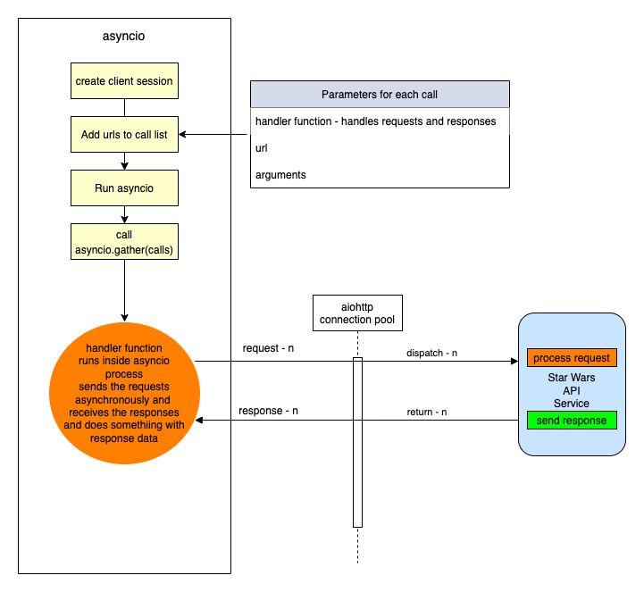

# starwars-api-backend-skeleton

---

###Backend API Learning Workflow:

---
### **Stage-2** 

#### Description: 
Develop a module that will provide access to the Star Wars API and connect that to our Films endpoint via a data access layer and introduce our API error handling..
<br/><br/>
<details>
<summary>1. Build an interface to the 'https://swapi.py4e.com/api/' api to retreive data about Star Wars.</summary>

   For this module we shall build a class, a star wars object that provides us access to an external source of Star Wars data.
   <br/><br/>
   Copy the code below into the starwars.py file.

   ```python
      # -*- coding: utf-8 -*-


    # ------------------------------------------------
    #    External imports
    # ------------------------------------------------
    
    import asyncio
    import aiohttp
    import requests
    
    # ------------------------------------------------
    #    Python Imports
    # ------------------------------------------------
    
    # ------------------------------------------------
    #     local Imports
    # ------------------------------------------------
    from errors.v1.handlers import DataAccessError
    
    # ------------------------------------------------
    #    Script Wide Variables
    # ------------------------------------------------
    URL = 'https://swapi.py4e.com/api/'
    
    
    # ------------------------------------------------
    #          CLASSES START HERE
    # ------------------------------------------------
    
    
    class StarWars(object):
        """
            Star Wars object
            Facilitates Async Calls to the swapi api for retrieval of star wars data.
            All methods are static helper functions with the exception of request_data.
            The request_data function is used to retrieve star wars data and called via api
            StarWars class object instance.
        """
    
        def __init__(self, **kwargs):
    
            # Variables used for each instance of the class.
            self.swars_data = []
   ```
   
   Above you can see that we have a class called StarWars and an __init__ method. This method is used to 
   add any variables to all new star wars objects.
    <br/><br/>
   Here you can see that we set the object variable swars_data to an empty list. We will see how this is used later.

   <br/><br/>
   
   Look at the 'External Imports' near the top of the page.

   ```python
    import asyncio
    import aiohttp
    import requests
   ```

In this module we shall use two types of methods to send requests. Let's look at them in order of least complexity.
<br/><br/>
   1. A synchronous request via the third import in the list - the package requests.
   <br/><br/>
   requests is a well known python package that handles requests to any reachable service.
   When your code makes a synchronous request it does not return until it receives the response blocking any further processing, i.e. you have to wait for the response before continuing.
   <br/><br/>
   We will use this kind of request when we require a single record from the Star Wars API.
   <br/><br/>
   
   ####A synchronous Request
    
   
   
  <br/>

2. Asynchronous requests via the packages asyncio and aiohttp.
      <br/><br/>
      We use asyncio along with aiohttp to create a set of input output tasks, i.e. in this case calls to the Star Wars APi and handle the responses via a function assigned to each call. 
      This is not the same as a promise in Javascript. We'll get to the details of how this works when we include the code shortly. In the meantime have a look at the following diagram to get a feel for we're going to do.
      <br/><br/>
      ####An asynchronous Request
      
      
       <br/><br/>
      As you can see from the diagram above, using an asyncio client session and aiohttp there is a connection pool that
      enables multiple requests to be sent simultaneously in any order to our Star Wars API.
      <br/><br/>
      Each call/task is configured with a handler/method a url for the actual address of the call and any arguments we 
      wish to send with the call. 
      <br/><br/>
      When we have added all our calls to the call list we then run the asyncio module and call asyncio gather with the calls
      list as a parameter. asyncio.gather will fire off all the calls which in turn call the handler/method that makes
      the calls. In that method handler, as we shall see in the code we use an 'await' keyword on the request. This tells the handler to
      stop processing the code in the handler at that point and allow the other code outside of it to be processed, which in this case means
      that the same method handler can be called again for the other requests. Each time releasing after the 'await'.
      <br/><br/>
      When each request receives a response, the asyncio knows to go back to the point in the code directly after the await. This happens for each and every call.
      <br/><br/>
      Now let's look at the code for both the synchronous and asynchronous calls made above.
      <br/><br/>
   
    ```python
        async def fetch_json(self, session: aiohttp.ClientSession(), url: str, **kwargs):
                  """
                     Async function to make multiple api calls and fetch json data for each call
                     Adding the data when received to the self.swars_data list
                  """
                  print(f"Requesting {url}")
                  resp = await session.request('GET', url=url, **kwargs)
                  if resp.status == 200:
                      data = await resp.json(content_type=None)
                      print(f"Received data for {url}")
                      # Put the results data on the end of the list
                      self.swars_data.extend(data['results'])
                  else:
                      error = f"url {url}"
                      raise DataAccessError(message=error, status_code=resp.status)
   
        async def api_query(self, urls, **kwargs):
                  """
                     Set up an async task for each url in urls and call the urls asynchronously.
                     Asyncio sets up a client connection to handle all the calls to the swapi api.
                     Calls fetch_json after each task/url call gets a response
                  """
                  # Single client session for all the api calls. We use an open HTTP connection for simplicity here. The
                  # data is open source...
                  client = aiohttp.ClientSession(connector=aiohttp.TCPConnector(ssl=False))

                  async with client as session:
                      # Create fetch tasks from the urls
                      tasks = []

                      for url in urls:
                          tasks.append(self.fetch_json(session=session, url=url, **kwargs))

                      # waits for asyncio.gather() to be completed, required because we want to sort when all data has arrived
                      await asyncio.gather(*tasks, return_exceptions=True)
                      # This has no effect - because we are using a with statement that will automatically close the session
                      # await session.close() 

        def request_data_async(self, query, batch_size=None, max_items=None):
            """
                This method formats n number of urls with the parameter 'query'

            param: query - the api query parameter i.e. films or people
            param: max_items: The maximum number of items to fetch
            params: batch_size: The maximum items returned across all batches/api calls
            """
            # Create the initial url
            urls = []
            urls_append = urls.append

            if max_items and batch_size and max_items > batch_size:
                for i in range(1, round(max_items / batch_size) + 1):
                    urls_append(f"{URL}{query}/?page={i}")
            else:
                urls.append(f"{URL}{query}/")

            # Call the api query function
            asyncio.run(self.api_query(urls)) 

        def request_data_sync(self, query):
            """
                Request and wait for our data to return
                In this method we are using the requests package to make a simple synchronous API call
                The code is blocked until the response is received.
            :param query: Contains query parameters for the request
            :return:
            """
            status = ""

            try:
                # Format the url from the main swapi url plus the query/queries
                url = f"{URL}{query}/"
                # make the request
                r = requests.get(url=url)
                # Raise the status to make sure it was successful. If it is not the below exception will occur
                status = r.status_code
                r.raise_for_status()

                # We have success - let's return the data
                # extracting data in json format
                self.swars_data = r.json()

            except requests.ConnectionError as e:
                msg = "OOPS!! Connection Error. Make sure you are connected to a live Internet connection."
                raise DataAccessError(message=msg, status_code=status)
            except requests.Timeout as e:
                msg = "OOPS!! Timeout Error"
                raise DataAccessError(message=msg, status_code=status)
            except requests.HTTPError as e:
                if status == 404:
                    msg = "Not Found"
                elif status == 400:
                    msg = "Bad Request"
                elif status == 500:
                    msg = "Server Error on the Star Wars Api"
                else:
                    msg = "Opps Something went wrong!!"
                raise DataAccessError(message=msg, status_code=status)
            except KeyboardInterrupt:
                msg = "Someone closed the program"
                raise DataAccessError(message=msg, status_code=status)
   ```
   
    <br/>
   Let's walk through the code and map it to the images above.
   <br/><br/>

   1. First let's look at the synchronous method.
   
      ```python
      def request_data_sync(self, query):
      ```

      This is perfectly straight forward. We simply pass in a query parameter such as 'films/1', which tells us we want to 
      retrieve data for the film with ID 1. 
      <br/>
      Next we append this to the Star Wars API url, then make the request using requests. When the response returns we check the status. 
      If it is a 200 (all good), we take the json response data from the response object and assign it to our swars_data variable we declared in the class __init__ method. This
      <br/><br/>
      If it is not ok we raise an exception. The exception message depends on the status. The exception being raised for all errors is the
      a DataAccessError. We'll get to our error handling shortly. For now, it is enough to know that errors/exceptions are being 
      handled.
   <br/><br/>
   
   2. Let's now explore the more complex asynchronous method.
      
    ```python
    def request_data_async(self, query, batch_size=None, max_items=None):
    ```
    As you can see we pass in three parameters.
    <br/><br/>
    * The query parameter
    * A batch_size parameter - this tells us how many items we would like the Star Wars API to return in a single call.
    * A max_items parameter - this tells us how many items in total across all calls we wish to retrieve.
   
    <br/><br/>

    This method builds n urls. Both batch_size and max_items are optional. If they have no value a single url is created by appending the Star Wars url with the query.
    Otherewise, a series of urls is created, according to the max_items being divided by the batch_size parameter. For each of these urls we not only append the query but also an extra
    query parameter called page, which equates to a number starting at 1 and ending in n+1. 

    <br/><br/>
    Once our urls have been created we run the asyncio via asyncio.run, passing it a call to our query function which has the urls and any other arguments as parameters.
    This function then gets called within the asyncio process.

    ```python
    async def api_query(self, urls, **kwargs):
    ```
   
    The first thing to notice about our api_query function is that the definition 'def' is preceded by 'async'.
    <br/><br/>
    When a function is preceded by the keyword 'async' we know that this function is an asynchronous coroutine and will call some process using the 'await' keyword.
    The 'await' keyword tells the code to pass back control to the event loop. Therefore, the method api_query is a coroutine that performs a bunch of asynchronous calls.
    <br/><br/>
    As you can see from the code we assign a bunch of tasks/request calls to a task list using the urls passed in. Each task is assignedd a method that it will call, 
    in this case
 
    ```python
    def fetch_json(self, session: aiohttp.ClientSession(), url: str, **kwargs):
    ```
   
    This method has session, a relevant url and any extra arguments as parameters. Once we call asyncio.gather in our api_query method, passing our task list as a parmeter, 
    the 'fetch_json' function will be executed asynchronously until all tasks have been called. So if we have 10 urls to call 'fetch_json' gets called 10 times. So
    
    What happens in fetch_json, simple it makes a request to the url with specified query and arguments using the client session (connection pool).
    It uses the 'await' keyword here to release the event loop to fire the next call...When the response comes, it checks the status and if all ok, 
    adds the returned json response data to our class object swars_data variable. If there is an error then it handles it by raising a DataAccessError. We
    <br/><br/>

    Hopefully you have understood what's happening now and are ready to move on, but before you do that copy the last section of code and append it to the starwars.py file.
    
</details>

<details>
<summary>2. Adding access to the above code for the endpoint via a DataAccess layer.</summary>

    We now have a gateway to the external Star Wars API data, but we need someway of connecting to that from our endpoint. This is where our data access layer comes into play.
    As mentioned in the introduction, we use a data access layer as a means to separate dealing with our data sources. This helps us maintain a robust structure and minimises maintenance, redundancy and refactoring.
    
    Let's look at the film endpoint again. Go to films/v1/endpoints.py and open it, you should see the following code for the endpoint get_film...

```python
def get_film(film_id, **kwargs):
    """
        Fetch a film's entity from its name
    :param film_id: The id of the film to be retrieved
    :return: Film Entity
    :errors:
        DataAccessError - raises an APIError
    """
    api_response()
```
    We are going to replace the line 'api_response()' with the code block below

```python
try:
    film = FilmDacc.film(film_id, kwargs['options'])
    return api_response(film)
except DataAccessError as e:
    raise ApiError(e.message, e.status_code, e.payload)
```

    This is our code for accessing the films data access layer. It is wrapped in a try except block. This allows us to catch any exceptions that occur in the data access layer
    and raise them here as an ApiError.

   The following line of code calls the class (FilmDacc) method (film) and passes the films ID, and any keyword arguments we wish to pass to the method. As can be seen below the keyword arguments are in fact our options.


```python
film = FilmDacc.film(film_id, kwargs['options'])
```
    This method, if successful, will return all of the film data for the requested film ID. Before we take a look at the class in our data films access layer we first need to import the FilmDacc object

    Under Films Data Access layer introduce the import thus:

```python
from films.v1.data_access import *
```

This uses the '*' notation to indicate state that we shall import everything from the data access layer data_access.py

Open the data_access.py file in the same folder and copy the following code into it.

```python
# -*- coding: utf-8 -*-

# ------------------------------------------------
#    Python Imports
# ------------------------------------------------

# ------------------------------------------------
#    External Imports
# ------------------------------------------------

# ------------------------------------------------
#     Module Imports
# ------------------------------------------------
from errors.v1.handlers import DataAccessError
from starwars import StarWars
from utils import options_filter

# ------------------------------------------------
#     Abstract Character Data Access Layer
# ------------------------------------------------

class FilmDacc(object):
    """
        Abstract Film Data Access Class
    """

    @staticmethod
    def film(film_id, options):
        """
             Retrieve a specific StarWars Film
        :param film_id:
        :param options: The options for filtering what gets returned - See API Specification
        :return: The filtered film data
        """
        starwars = StarWars()
        # Build and request the URL by adding the film_id
        starwars.request_data_sync('films/'+film_id)
        return options_filter(starwars.swars_data, options)[0]
```

Let's examine the code.

Under Module Imports you can see that there are three imported packages, our error handling (we'll get to that afterwards),
the StarWars class we recently created and an options_filter from our utils.py module. Don't worry about that now, again we'll get to that later.
Our focus for the moment is on the StarWars class which provides us a route into the external Star Wars API.
<br/><br/>
Look at the class we have created for our Films data access layer.

Currently, the class has a single staticmethod called film, which has two parameters, the film id and options. The film ID is obviously an ID, the options are a key-value pair object. A python dictionary.
Hopefully you remember your python fundamentals and that a staticmethod is a class method that can be called directly from a class without creating a new object.

To understand our options we need to briefly go back to our openAPI specification for films and look at these options. Look at the specification endpoint below and check the parameters, there you can see the parameter 'options'.


```yaml
# -----------------------------------------------
  # Film paths - REQUESTS
  # -----------------------------------------------

  /films/v1/{film_id}:

    get:
      summary: Retrieve a specific star wars film data set
      tags:
        - Film
      description: >
        
        Errors:

          token-invalid, 401
          authorisation-required, 401
          not-found, 404

      operationId: films.v1.endpoints.get_film
      parameters:
        - name: "film_id"
          description: Films Unique id
          in: path
          required: true
          schema:
            type: string
        - name: "options"
          in: query
          description: Optional Film Data
          required: false
          style: deepObject
          schema:
            $ref: '#/components/schemas/FilmExtras'
      responses:
        '200':
          description: Returns a data object containing a Films data
          content:
            application/json:
              schema:
                $ref: '#/components/schemas/FilmResponse'
```

The parameter 'options' is a deepObject which means it has more than one level and is referenced by the schema FilmExtras.
Unlike our 'film_id' parameter our 'options' parameter is placed in the query of the request and not in the path.

```yaml
# -----------------------------------------------
#  Film Extras REQUEST SCHEMA
# -----------------------------------------------
FilmExtras:
  type: object
  properties:
    characters:
      description: provide film character urls
      type: boolean
    planets:
      description: provide all film planet urls
      type: boolean
    species:
      description: provide all film species urls
      type: boolean
    starships:
      description: provide all film starship urls
      type: boolean
    vehicles:
      description: provide all film vehicle urls
      type: boolean
```

As can be seen FilmExtras is an openAPI schema object containing several properties. Each of those properties is a boolean. It can be true or false. 
Take a quick peak at our API interface to check how this object is represented.


The object in question is a simple Json key-value pair object and by default each key has a value set to true. 
We can change the value to false if we do not require the information to be passed back in the response.

Getting back to our data access method called film...

```python
starwars = StarWars()
# Build and request the URL by adding the film_id
starwars.request_data_sync('films/'+film_id)
return options_filter(starwars.swars_data, options)[0]
```

Here's what's happening line by line.

* ####starwars = StarWars()
  We are assigning a new instance of the class StarWars as an object an assigning it to our variable starwars.
  <br/><br/>
* ####starwars.request_data_sync('films/'+film_id)
  We call the object method request_dat_sync with a parameter that encompasses the path for films and an extra path variable which is the film ID.
  <br/><br/>
* ####return options_filter(starwars.swars_data, options)[0]
  This line returns the results of the options_filter function in the utils.py file. It does this by passing in the starwars object variable swars_data.
  We also pass in the options object, so the options filter can test for the options against the data in the response. Notice that at the end of the line and after the function call is closed we have [0].
  This is stating that in the list returned we only require the first item of the list and not the whole list. Why? Well because this is an endpoint that returns a single data item and it seems pointless to send this back as a list.
  We could of course avoid this if we did some tests on the list in the options_filter function and return the item itself and not the list, if indeed the list was made up of a single item.
  This is a choice, we make a decision and run with it. You will come across plenty of similar scenarios during your coding lifetime.


 Summing up so far.

* We have introduced the StarWars class for access to our external Star Wars data source.
* We have introduced the required data access layer class and method to act as the data gateway between our endpoint and the external data source.
* We have modified our endpoint to interface with the data access layer
* We have understood our 'options' object.

Now we shall do the following

* Introduce our options_filter function in our utils.py file
* Add our error handling for exceptions.

</details>
