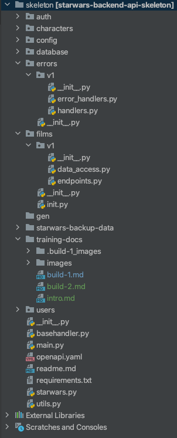
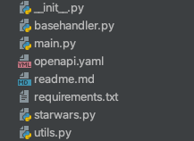
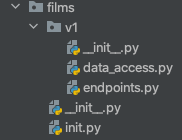
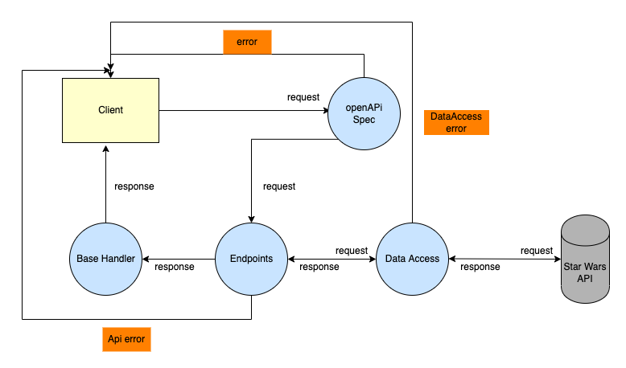
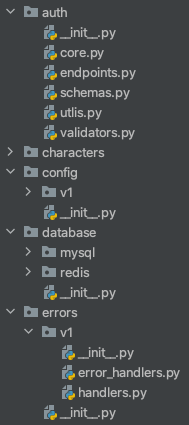

# starwars-api-backend-skeleton

---

### Backend API Learning Workflow:

Introduction:

Welcome to the Star Wars backend api learning project. The project has a complete structure
ready for you to start learning the process of buidling this backend. Before we begin building the backend, 
let's take a look at the structure in more detail. 
  
Below is an image of the structure:

As you can see there are many folders, some of which are open and a bunch of files in the root.
  

Let's quickly go over the design of the api by looking at root files and the films folder.
  
The root files - all of which are empty except requirements.txt and the readme.md:

* __init__.py - The root python initialisation file
* basehandler.py - Will contain the main function required for any packaging of the responses to API requests back 
* main.py - Will contain the main python/flask module for running the API
* openapi.yaml - Our APIs openAPI 3 definition document. This document will contain the specification for our API, all the rules for requests and responses  shall be defined here along with all the parameters and where those parameters go for both requests and responses. It shall also contain our security definitions as to the tyoe of authentication we may use.
* readme.md - The main project readme file.
* requirements.txt - The only file with content contains the package list required to run the API. You should have already run the requirements.txt file directly after creating  your project virtual environment and selecting a python interpreter.
* starwars.py - This file will contain our APIs handlign of calls to the Star Wars API at 'https://swapi.py4e.com/api/'
* utils.py - Will contain any utility classes or functions we made need.

 
Now let's look at the typical API structure using films.

* v1 - this is used for versioning our API, v1=version1. At some point we may have a v2 foilder, which contain the same files but with different code, a newer version. We can direct API requests to different versions, for example we may have v2 for characters but not for films, so we can direct all the character api requests to v2 of the character code.
__init__.py - the python initialisation package for this folder.
* data_access.py - Handles all of the access to any data for films. Anything that touches our data and data source is defined in this file. 
Note we do not touch data in the endpoints methods. Why would we do this, well if we change our datasource, we modify that in this file and not in the endpoints, thus our endpoints do not have to change if we change our data source. It's about separation to help keep our code design as straight forward and robust as possible.
* endpoints.py - Endpoints are the basis of our API calls and are linked to their relative functions via the openapi.yaml file. This file contains all the functions for our endpoints. The endpoint passes any requests for data to our data_access.py file which in turn passes any data to be returned to the client back to the endpoint. The endpoint then calls our basehandler which forwards the response back to the client through various other packages.
* The other files are all __ini__.py files for python initialisation.

 
To get a feel for the flow of our API request and response check the simple data flow diagram below.

 
Finally let's look at the folders auth, config, database and errors.

* auth - All of the files for authentication and security for our API are here. 
* config - Any and all configuration such as database login details, security hashes used and anything else for configuration. This
* database - All the database handling is done here. We use two types of database in this project, MySQL a sequel server database and Redis a no-sql database.
* errors - This contains any error handling for the API.

That's it, so let's proceed to our build-1.md file under training-docs and get started.
  

Have Fun! :)

Building Our API

[Stage 1 - API Foundation - app, endpoint - Api specification](stage-1.md)
 
[Stage 2 - Extending the API - external Api access, data access layer, filtering options, error handling, another endpoint](stage-2.md)
 
[Stage 3 - Go it alone - Exercise](stage-3.md)
 
[Stage 4 - Adding Authentication](stage-4.md)
 
[Stage 5 - Introducing Users](stage-5.md)
