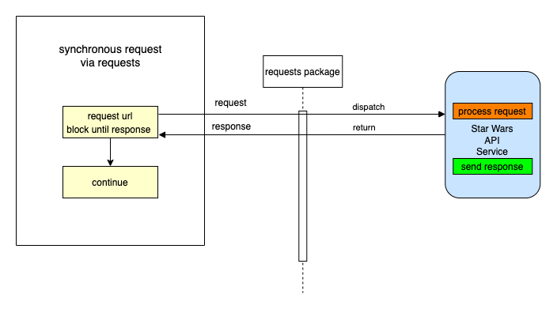
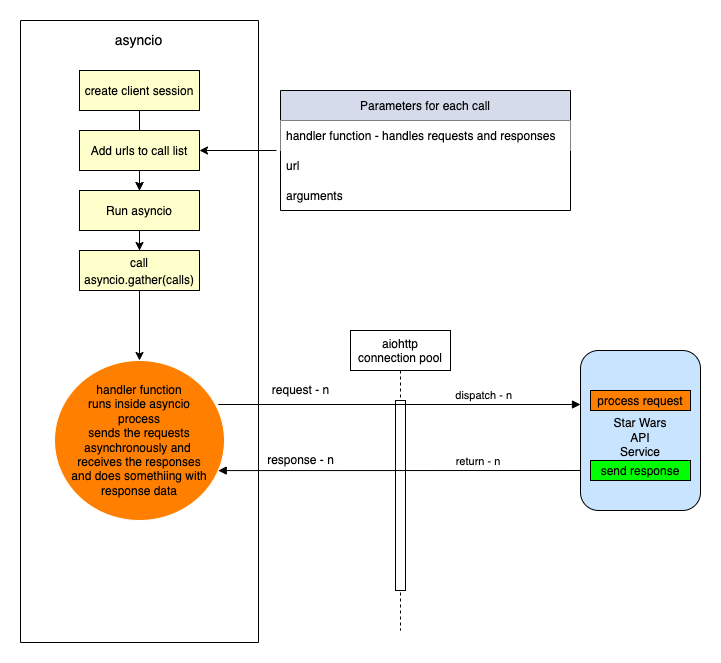
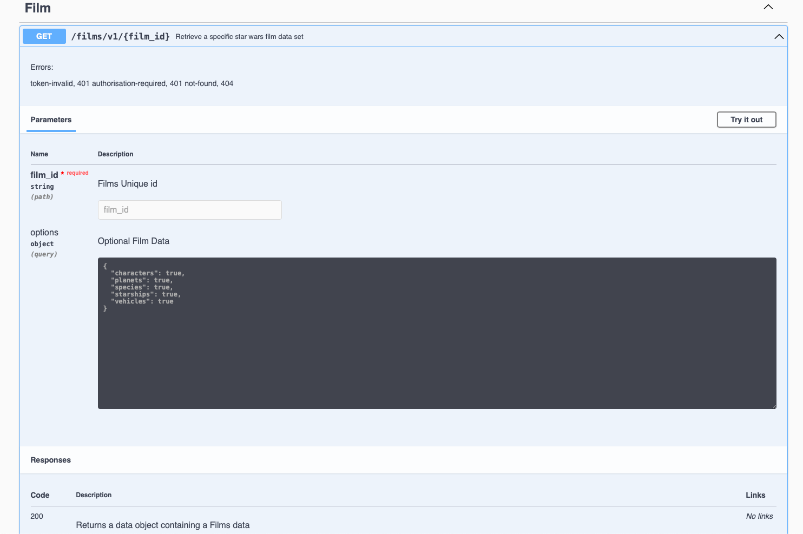
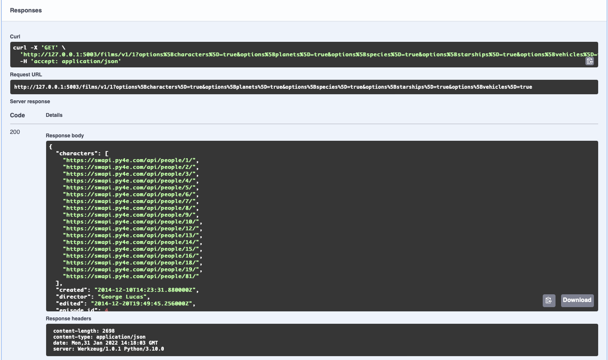
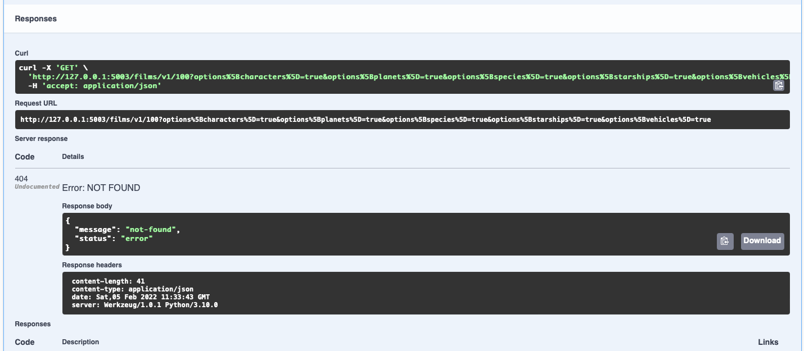
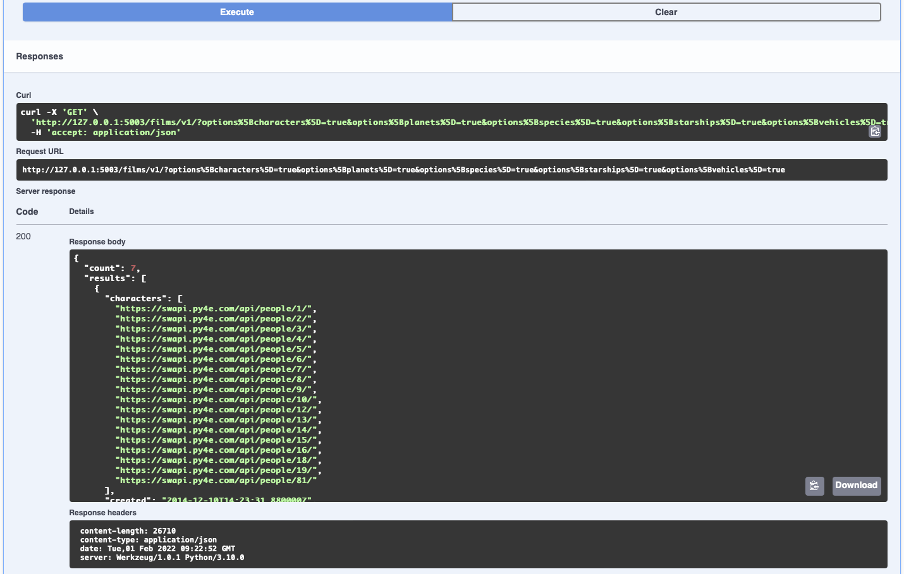

# starwars-api-backend-skeleton

---

### Backend API Learning Workflow:

---
### Stage-2:
<span style="color:#FF1B55FF">Extending the API - external Api access, data access layer, filtering options, error handling, another endpoint</span>

#### Description: 
    Develop a module that will provide access to the Star Wars API and connect that to our Films endpoint via a data access layer and introduce our API error handling..

<details>
<summary style="color:#4ba9cc">1. Build an interface to the 'https://swapi.py4e.com/api/' api to retreive data about Star Wars.</summary>

    For this module we shall build a class, a star wars object that provides us access to an external source of Star Wars data.
    
    Copy the code below into the starwars.py file.

```python
# -*- coding: utf-8 -*-

# ------------------------------------------------
#    External imports
# ------------------------------------------------

import asyncio
import aiohttp
import requests

# ------------------------------------------------
#    Python Imports
# ------------------------------------------------

# ------------------------------------------------
#     Module Imports
# ------------------------------------------------
from errors.v1.handlers import ApiError

# ------------------------------------------------
#    Script Wide Variables
# ------------------------------------------------
URL = 'https://swapi.py4e.com/api/'


# ------------------------------------------------
#          CLASSES START HERE
# ------------------------------------------------


class StarWars(object):
    """
        Star Wars object
        Facilitates Async Calls to the swapi api for retrieval of star wars data.
        All methods are static helper functions with the exception of request_data.
        The request_data function is used to retrieve star wars data and called via api
        StarWars class object instance.
    """

    def __init__(self, **kwargs):

        # Variables used for each instance of the class.
        self.swars_data = []
  ```
   
    Above you can see that we have a class called StarWars and an __init__ method. This method is used to 
    add any variables to all new star wars objects.
    
    Here you can see that we set the object variable swars_data to an empty list. We will see how this is used later.

    Look at the 'External Imports' near the top of the page.

```python
import asyncio
import aiohttp
import requests
```

    In this module we shall use two types of methods to send requests. Let's look at them in order of least complexity.

    1. A synchronous request via the third import in the list - the package 'requests'.
   
       'requests' is a well known python package that handles requests to any reachable service.

       When your code makes a synchronous request it does not return until it receives the response blocking any further
       processing, i.e. you have to wait for the response before continuing.
   
       We will use this kind of request when we require a single record from the Star Wars API.
   
   
#### A synchronous Request
    


    2. Asynchronous requests via the packages asyncio and aiohttp.
       We use asyncio along with aiohttp to create a set of input output tasks, i.e. in this case calls to the Star Wars APi and handle the responses via a function assigned to each call. 
       This is not the same as a promise in Javascript. We'll get to the details of how this works when we include the code shortly. In the meantime have a look at the following diagram to get a feel for we're going to do.
      
#### An asynchronous Request
      

       
      As you can see from the diagram above, using an asyncio client session and aiohttp there is a connection pool that
      enables multiple requests to be sent simultaneously in any order to our Star Wars API.
      
      Each call/task is configured with a handler/method a url for the actual address of the call and any arguments we 
      wish to send with the call. 
      
      When we have added all our calls to the call list we then run the asyncio module and call asyncio gather with the calls
      list as a parameter. asyncio.gather will fire off all the calls which in turn call the handler/method that makes
      the calls. In that method handler, as we shall see in the code we use an 'await' keyword on the request. This tells the handler to
      stop processing the code in the handler at that point and allow the other code outside of it to be processed, which in this case means
      that the same method handler can be called again for the other requests. Each time releasing after the 'await'.
      
      When each request receives a response, the asyncio knows to go back to the point in the code directly after the await. This happens for each and every call.
      
      Now let's look at the code for both the synchronous and asynchronous calls made above.
      
   
```python
async def fetch_json(self, session: aiohttp.ClientSession(), url: str, **kwargs):
      """
         Async function to make multiple api calls and fetch json data for each call
         Adding the data when received to the self.swars_data list
      """
      print(f"Requesting {url}")
      resp = await session.request('GET', url=url, **kwargs)
      if resp.status == 200:
          data = await resp.json(content_type=None)
          print(f"Received data for {url}")
          # Put the results data on the end of the list
          self.swars_data.extend(data['results'])
      else:
          error = f"url {url}"
          raise ApiError(message=error, status_code=resp.status)

async def api_query(self, urls, **kwargs):
      """
         Set up an async task for each url in urls and call the urls asynchronously.
         Asyncio sets up a client connection to handle all the calls to the swapi api.
         Calls fetch_json after each task/url call gets a response
      """
      # Single client session for all the api calls. We use an open HTTP connection for simplicity here. The
      # data is open source...
      client = aiohttp.ClientSession(connector=aiohttp.TCPConnector(ssl=False))

      async with client as session:
          # Create fetch tasks from the urls
          tasks = []

          for url in urls:
              tasks.append(self.fetch_json(session=session, url=url, **kwargs))

          # waits for asyncio.gather() to be completed, required because we want to sort when all data has arrived
          await asyncio.gather(*tasks, return_exceptions=True)
          # This has no effect - because we are using a with statement that will automatically close the session
          # await session.close() 

def request_data_async(self, query, batch_size=None, max_items=None):
    """
        This method formats n number of urls with the parameter 'query'
    
    param: query - the api query parameter i.e. films or people
    param: max_items: The maximum number of items to fetch
    params: batch_size: The maximum items returned across all batches/api calls
    """
    # Create the initial url
    urls = []
    urls_append = urls.append
    
    if max_items and batch_size and max_items > batch_size:
        for i in range(1, round(max_items / batch_size) + 1):
            urls_append(f"{URL}{query}/?page={i}")
    else:
        urls.append(f"{URL}{query}/")
    
    # Call the api query function
    asyncio.run(self.api_query(urls)) 

def request_data_sync(self, query):
    """
        Request and wait for our data to return
        In this method we are using the requests package to make a simple synchronous API call
        The code is blocked until the response is received.
    :param query: Contains query parameters for the request
    :return:
    """
    status = ""
    
    try:
        # Format the url from the main swapi url plus the query/queries
        url = f"{URL}{query}/"
        # make the request
        r = requests.get(url=url)
        # Raise the status to make sure it was successful. If it is not the below exception will occur
        status = r.status_code
        r.raise_for_status()
    
        # We have success - let's return the data
        # extracting data in json format
        self.swars_data = r.json()
    except requests.ConnectionError as e:
        msg = "OOPS!! Connection Error. Make sure you are connected to a live Internet connection."
        raise ApiError(message=msg, status_code=status)
    except requests.Timeout as e:
        msg = "timeout-error"
        raise ApiError(message=msg, status_code=status)
    except requests.HTTPError as e:
        if status == 404:
            msg = "not-found"
        elif status == 400:
            msg = "bad-request"
        elif status == 500:
            msg = "server-error-star-wars-api"
        else:
            msg = "something-went-wrong"
        raise ApiError(message=msg, status_code=status)
    except KeyboardInterrupt:
        msg = "program-closed"
        raise ApiError(message=msg, status_code=status)        
```

    Let's walk through the code and map it to the images above.

    1. First let's look at the synchronous method.
   
```python
def request_data_sync(self, query):
```
    This is perfectly straight forward. We simply pass in a query parameter such as 'films/1', which tells us we want to 
    retrieve data for the film with ID 1. 
    
    Next we append this to the Star Wars API url, then make the request using requests. When the response returns we check the status. 
    If it is a 200 (all good), we take the json response data from the response object and assign it to our swars_data variable we declared in the class __init__ method. This
    
    If it is not ok we raise an exception. The exception message depends on the status. The exception being raised for all errors is the
    an ApiError. We'll get to our error handling shortly. For now, it is enough to know that errors/exceptions are being 
    handled.
   
    2. Let's now explore the more complex asynchronous method.
      
```python
def request_data_async(self, query, batch_size=None, max_items=None):
```

    As you can see we pass in three parameters.

        * The query parameter
        * A batch_size parameter - this tells us how many items we would like the Star Wars API to return in a single call.
        * A max_items parameter - this tells us how many items in total across all calls we wish to retrieve.


    This method builds n urls. Both batch_size and max_items are optional. If they have no value a single url is created by appending the Star Wars url with the query.
    Otherewise, a series of urls is created, according to the max_items being divided by the batch_size parameter. For each of these urls we not only append the query but also an extra
    query parameter called page, which equates to a number starting at 1 and ending in n+1. 

    Once our urls have been created we run the asyncio via asyncio.run, passing it a call to our query function which has the urls and any other arguments as parameters.
    This function then gets called within the asyncio process.

```python
async def api_query(self, urls, **kwargs):
```

    The first thing to notice about our api_query function is that the definition 'def' is preceded by 'async'.
    
    When a function is preceded by the keyword 'async' we know that this function is an asynchronous coroutine and will call some process using the 'await' keyword.
    The 'await' keyword tells the code to pass back control to the event loop. Therefore, the method api_query is a coroutine that performs a bunch of asynchronous calls.
    
    As you can see from the code we assign a bunch of tasks/request calls to a task list using the urls passed in. Each task is assignedd a method that it will call, 
    in this case
 
```python
def fetch_json(self, session: aiohttp.ClientSession(), url: str, **kwargs):
```

    This method has session, a relevant url and any extra arguments as parameters. Once we call asyncio.gather in our api_query method, passing our task list as a parmeter, 
    the 'fetch_json' function will be executed asynchronously until all tasks have been called. So if we have 10 urls to call 'fetch_json' gets called 10 times. So
    
    What happens in fetch_json, simple it makes a request to the url with specified query and arguments using the client session (connection pool).
    It uses the 'await' keyword here to release the event loop to fire the next call...When the response comes, it checks the status and if all ok, 
    adds the returned json response data to our class object swars_data variable. If there is an error then it handles it by raising an Api Error.
    
    Hopefully you have understood what's happening now and are ready to move on, but before you do that copy the last section of code and append it to the starwars.py file.

</details>

<details>
<summary style="color:#4ba9cc">2. Adding access to the above code for the endpoint via a DataAccess layer.</summary>

    We now have a gateway to the external Star Wars API data, but we need someway of connecting to that from our endpoint. This is where our data access layer comes into play.
    As mentioned in the introduction, we use a data access layer as a means to separate dealing with our data sources. This helps us maintain a robust structure and minimises maintenance, redundancy and refactoring.
    
    Let's look at the film endpoint again. Go to films/v1/endpoints.py and open it, you should see the following code for the endpoint get_film...

```python
def get_film(film_id, **kwargs):
    """
        Fetch a film's entity from its name
    :param film_id: The id of the film to be retrieved
    :return: Film Entity
    :errors:
        ApiError - raises an APIError
    """
    api_response()
```
    We are going to replace the line 'api_response()' with the code block below

```python
film = FilmDacc.film(film_id, kwargs['options'])
return api_response(film)
```

    This is our code for accessing the films data access layer.

    The following line of code calls the class (FilmDacc) method (film) and passes the films ID, and any keyword arguments we wish to pass to the method.
    As can be seen below the keyword arguments are in fact our options.


```python
film = FilmDacc.film(film_id, kwargs['options'])
```
    This method, if successful, will return all of the film data for the requested film ID. Before we take a look at the class in our data films access layer
    we first need to import the FilmDacc object
    
    Under Films Data Access layer introduce the import thus:

```python
from films.v1.data_access import *
```

    This uses the '*' notation to indicate that we shall import everything from the data access layer data_access.py
    
    Open the data_access.py file in the same folder and copy the following code into it.

```python
# -*- coding: utf-8 -*-

# ------------------------------------------------
#    Python Imports
# ------------------------------------------------

# ------------------------------------------------
#    External Imports
# ------------------------------------------------

# ------------------------------------------------
#     Module Imports
# ------------------------------------------------
from starwars import StarWars
from utils import options_filter

# ------------------------------------------------
#     Abstract Character Data Access Layer
# ------------------------------------------------

class FilmDacc(object):
    """
        Abstract Film Data Access Class
    """

    @staticmethod
    def film(film_id, options):
        """
             Retrieve a specific StarWars Film
        :param film_id:
        :param options: The options for filtering what gets returned - See API Specification
        :return: The filtered film data
        """
        starwars = StarWars()
        # Build and request the URL by adding the film_id
        starwars.request_data_sync('films/'+film_id)
        return options_filter(starwars.swars_data, options)[0]
```

    Let's examine the code.
    
    Under Module Imports you can see that there are three imported packages, our error handling (we'll get to that afterwards),
    the StarWars class we recently created and an options_filter from our utils.py module. Don't worry about that now, again we'll get to that later.
    Our focus for the moment is on the StarWars class which provides us a route into the external Star Wars API.
    
    Look at the class we have created for our Films data access layer.
    
    Currently, the class has a single staticmethod called film, which has two parameters, the film id and options. The film ID is obviously an ID, the options are a key-value pair object. A python dictionary.
    Hopefully you remember your python fundamentals and that a staticmethod is a class method that can be called directly from a class without creating a new object.
    
    To understand our options we need to briefly go back to our openAPI specification for films and look at these options. Look at the specification endpoint below and check the parameters, there you can see the parameter 'options'.


```yaml
# -----------------------------------------------
  # Film paths - REQUESTS
  # -----------------------------------------------

  /films/v1/{film_id}:

    get:
      summary: Retrieve a specific star wars film data set
      tags:
        - Film
      description: >
        
        Errors:

          token-invalid, 401
          authorisation-required, 401
          not-found, 404

      operationId: films.v1.endpoints.get_film
      parameters:
        - name: "film_id"
          description: Films Unique id
          in: path
          required: true
          schema:
            type: string
        - name: "options"
          in: query
          description: Optional Film Data
          required: false
          style: deepObject
          schema:
            $ref: '#/components/schemas/FilmExtras'
      responses:
        '200':
          description: Returns a data object containing a Films data
          content:
            application/json:
              schema:
                $ref: '#/components/schemas/FilmResponse'
```

    The parameter 'options' is a deepObject which means it has more than one level and is referenced by the schema FilmExtras.
    Unlike our 'film_id' parameter our 'options' parameter is placed in the query of the request and not in the path.

```yaml
# -----------------------------------------------
#  Film Extras REQUEST SCHEMA
# -----------------------------------------------
FilmExtras:
  type: object
  properties:
    characters:
      description: provide film character urls
      type: boolean
    planets:
      description: provide all film planet urls
      type: boolean
    species:
      description: provide all film species urls
      type: boolean
    starships:
      description: provide all film starship urls
      type: boolean
    vehicles:
      description: provide all film vehicle urls
      type: boolean
```

    As can be seen FilmExtras is an openAPI schema object containing several properties. Each of those properties is a boolean. It can be true or false. 
    Take a quick peak at our API interface to check how this object is represented.



    The object in question is a simple Json key-value pair object and by default each key has a value set to true. 
    We can change the value to false if we do not require the information to be passed back in the response.
    
    Getting back to our data access method called film...

```python
starwars = StarWars()
# Build and request the URL by adding the film_id
starwars.request_data_sync('films/'+film_id)
return options_filter(starwars.swars_data, options)[0]
```

    Here's what's happening line by line.

#### starwars = StarWars()
    We are assigning a new instance of the class StarWars as an object an assigning it to our variable starwars.
#### starwars.request_data_sync('films/'+film_id)
    We call the object method request_dat_sync with a parameter that encompasses the path for films and an extra path variable which is the film ID.
    
#### return options_filter(starwars.swars_data, options)[0]
    This line returns the results of the options_filter function in the utils.py file. It does this by passing in the starwars object variable swars_data.
    We also pass in the options object, so the options filter can test for the options against the data in the response. Notice that at the end of the line and after the function call is closed we have [0].
    This is stating that in the list returned we only require the first item of the list and not the whole list. Why? Well because this is an endpoint that returns a single data item and it seems pointless to send this back as a list.
    We could of course avoid this if we did some tests on the list in the options_filter function and return the item itself and not the list, if indeed the list was made up of a single item.
    This is a choice, we make a decision and run with it. You will come across plenty of similar scenarios during your coding lifetime.

    Summing up so far.

      * We have introduced the StarWars class for access to our external Star Wars data source.
      * We have introduced the required data access layer class and method to act as the data gateway between our endpoint and the external data source.
      * We have modified our endpoint to interface with the data access layer
      * We have understood our 'options' object.

</details>

<details>
<summary style="color:#4ba9cc">3. Introduce our options_filter function in our utils.py file</summary>

    We already understand what our options_filter function has to do, now let's look at the code and see how it does it.

```python
# -*- coding: utf-8 -*-

# ------------------------------------------------
#    External imports
# ------------------------------------------------

# ------------------------------------------------
#    Python Imports
# ------------------------------------------------

# ------------------------------------------------
#    Module Imports
# ------------------------------------------------


def options_filter(data, options):
    """
        Filters through a list of dictionaries or a single dictionary and removes any data from the options dict that is set to false

    :param data: maybe a list of dicts or a single dict
    :param options: The options to filter on
    :return: Filtered data
    """

    # Define an empty list to hold all our filtered dictionaries
    fl = []

    def filter_options(data_set, options):
        new_dict = {}
        for k, _ in data_set.items():
            # The following line is a dictionary comprehension. It is used to filter optional data specified in the kwargs argument.
            # which is passed into the API by the client request as a Json dictionary of options.
            # The way it works is to filter key-value pairs from the returned film_entity dictionary against the kwargs dictionary.
            # Any key-value pair in the film_entity dictionary that is in the options dictionary of kwargs and set to False should be excluded from the returned data.
            filtered_dict = {k: v for (k, v) in data_set.items() if k not in options or options[k] is True}
            new_dict.update(filtered_dict)
        return new_dict

    if isinstance(data, list):

        for item in data:
            if isinstance(item, dict):
                fd = filter_options(item, options)
                fl.append(fd)
                
    elif isinstance(data, dict):
        
        fd = filter_options(data, options)
        fl.append(fd)
        
    else:
        return data

    return fl


```

    The function has two parameters

      * data - a python dictionary or list of dictionaries containing the options to filter
      * options - the object that contains the key-value pair mapping of data we want to include or not.

    Let's go through what's happening step by step.

    1. We declare an empty list - fl = []

    2. We check if our data parameter is a list.
      
      If it is a list we use an iteration (for loop) to take each object (item) from the data and call the function
      filter_options with the item and the options object. We make sure the item is a dictionary before we pass it. If it is not, we ignore it and continue the loop.
      We'll cover filter_options shortly. If it is a dictionary object we then take the result and append it to the list we declared earlier 'fl'
      The loop concludes when all data items have been through the function filter_options. Our resulting 'fl' list contains all the items with our options applied to them
      
      If it is not a list make sure it is a dictionary object and pass the object to filter_options along with the options object and append the result to our 'fl' list, which contains a single item filtered using our options object.
      
      If it is neither a list nor a dictionary then we ignore it and pass back the data as it came.
      
    3. Return 'fl'


       The function filter_options has the task of iterating over the item (data_set) keys and comparing those against keys in the options object which is a dictionary.

       The algorithm works as follows:

          1. Declare a new empty dictionary called new_dict.
          2. Iterate over the items in the data_set and filter them via a dictionary comprehension function as follows
        
             The dictionary comprehension does the following:
         
               * Takes each key-value pair from the data_set and checks to see if the same key is in options and is set to True, if it is set to True or the key is not in options the key-value pair are added to the
                 variable filtered_dict. 
               * The new_dict variable is then updated with the contents of filtered_dict. 
         
                 The filtered data is returned and forwarded on in the api_response to the client.
          
       That's it for our options_filter function. Now let's take that code and add it to our utils.py file.

</details>

<details>
<summary style="color:#4ba9cc">4. Add our error handling for exceptions</summary>

    As we have seen in the various blocks of code there are numerous exception possibilities. We need to present these exceptions in
    a standard manner for both us the developers and the client. 

    We use one exception declaration in our code:
    
      * ApiError

    Let's look at the exception handling in the 'request_data_sync'

```python
def request_data_sync(self, query):
    """
        Request and wait for our data to return
        In this method we are using the requests package to make a simple synchronous API call
        The code is blocked until the response is received.
    :param query: Contains query parameters for the request
    :return:
    """
    status = ""

    try:
        # Format the url from the main swapi url plus the query/queries
        url = f"{URL}{query}/"
        # make the request
        r = requests.get(url=url)
        # Raise the status to make sure it was successful. If it is not the below exception will occur
        status = r.status_code
        r.raise_for_status()

        # We have success - let's return the data
        # extracting data in json format
        self.swars_data = r.json()

    except requests.ConnectionError as e:
        msg = "OOPS!! Connection Error. Make sure you are connected to a live Internet connection."
        raise ApiError(message=msg, status_code=status)
    except requests.Timeout as e:
        msg = "OOPS!! Timeout Error"
        raise ApiError(message=msg, status_code=status)
    except requests.HTTPError as e:
        if status == 404:
            msg = "Not Found"
        elif status == 400:
            msg = "Bad Request"
        elif status == 500:
            msg = "Server Error on the Star Wars Api"
        else:
            msg = "Opps Something went wrong!!"
        raise ApiError(message=msg, status_code=status)
    except KeyboardInterrupt:
        msg = "Someone closed the program"
        raise ApiError(message=msg, status_code=status)
```

    As can be seen from the code, the 'requests' package has numerous exceptions itself. We use these to catch the various exceptions that occur when using the 'requests' package.
    However, we then raise our own exception ApiError and assign the message and status code to it.

    But why have an ApiError as well as the other exceptions. Predominantly two reasons:

      * To set an exception standard at certain points that perform certain logic, i.e. accessing data
      * To tailor the exception message. When using various packages, you get slightly different messages for the same error.
        By tailoring the messages to a standard we don't bombard the client with different messages for the same exception.

    When we write an API or other codebase for that matter we may decide on a number of exceptions to standardise on, this makes our life easier as a developer.
    However, we do not want to confuse the client with a number of different exceptions. Where those occur in our codebase is not really interesting to a client of the API.
    
    So what we do is we define a single exception to use for communicating exceptions to the client. In our case it's our ApiError exception handler,
    the ApiError.

    Coding our exceptions:
    
    Before we get into the actual error handling functions which will exist in 'errors/v1/handlers.py', we need to make a couple of changes to the main.py file that
    
    Under 'Module Imports' in main.py place the following line of code

```python
from errors.v1 import handlers as error_handlers
```

    Then add the following directly under the app.add.api function call. Placing a new line inbetween 

```python
app.app.register_blueprint(error_handlers.error_handlers)
```

    What the above line does is add a Flask blueprint registration. Blueprints are typically used to modularise a Flask application. But in this instance we are using it to 
    add our error handling functions as a module. 

    There are several ways to handle exceptions in Flask, some simpler than others. The reason we are using a blueprint is so that we can
    place all of our error code in a separate file and not in our main.py. Again, this provides clarity to our code structure, we know where things are.
    
    The following error handling code shows how this is done.

```python
# -*- coding: utf-8 -*-

# ------------------------------
#  External Imports
# ------------------------------
from flask import Blueprint
from flask import jsonify

# ------------------------------
#  Python Imports
# ------------------------------
import logging

# ------------------------------
#  Module Imports
# ------------------------------


# ------------------------------
#  Flask Blueprint Declaration
# ------------------------------
error_handlers = Blueprint('error_handlers', __name__)


# ------------------------------
#  Error Classes
# ------------------------------

class ApiError(Exception):
    """
        Parent Error Class - inherits default Exception
    :param: Exception - The raised exception
    """
    def __init__(self, message='There was an error', status_code=500, payload=None):
        """
        Class
        :param message: String
        :param status_code: Integer
        :param payload: Dict
        """
        Exception.__init__(self)
        self.message = message

        if status_code is not None:
            self.status_code = status_code
        self.payload = payload
        super(ApiError, self).__init__(message, status_code, payload)

    def to_dict(self):
        """
            Convert payload to a dictionary and add the message
        :return:
        """
        rv = dict(self.payload or ())
        rv['message'] = self.message
        rv['status'] = "error"
        return rv


@error_handlers.app_errorhandler(ApiError)
def handle_api_error(error):
    """
        Handles and logs the ApiError
    :param error: The actual error
    :return: error response
    """
    response = jsonify(error.to_dict())
    response.status_code = error.status_code
    logging.error(str(response.json['message']))
    return response

```

    As you can see we are importing our error handling blueprint that was registered in our main.py file.

```python
# ------------------------------
#  Flask Blueprint Declaration
# ------------------------------
error_handlers = Blueprint('error_handlers', __name__)
```
    Our custom exception class is then defined.

      * ApiError

    ApiError inherits from the default python exception class 'Exception'.

    The ApiError class takes upto three parameters, if none of these parameters are defined in the call, i.e. ApiError(), Then
    they are defined inline in the function head.


    The last function in the code above called handle_api_error is decorated with our registered blueprint error_handler which calls the function
    app_errorhandler with the parameter of our class error, in this case APiError.
    
    What this does is:

     * Take an instance of a raised ApiError (class object) and passes it to the function as the parameter 'error'.
     * Assigns a jsonified version of the arguments of the error via the class method 'to_dict', in this case, message, status and payload if it exists, to the variable 'response'
     * Adds the status to the response - so the client can retrieve it separately, but this is not strictly necessary as a call to the api that results in an error will
       receive the status code back from whatever method they are using to access the api.
     * Logs the error message (converting it to a string) - helps us developers out.
     * Returns the response

    Copy the above code to the error handler at errors/v1/handlers.py

    That's it our error handling is now in place. 

</details>

<details>
<summary style="color: #ffc300">Testing Endpoint 1</summary>

    Let's test our code now. Run the main.py app again

      * Copy 'http://127.0.0.1:5003/ui' into the browser
      * Click on the Film endpoint
      * Click on 'Try it out'
      * Stick a 1 into the filed that says 'Film_id'
      * Click the blue execute bar 

    Hey Presto you should see the following responses:



    Now let's check our API exceptions are working. Do the same as above, but instead of putting a 1 as the film id, put 100 
    and execute it again.



    As you can see our exception handling is working. We have a 404 not-found error.

    Great stuff!

    We have our first API endpoint running successfully. We have retrieved the complete data set of the Star Wars Movie 'A New Hope' from an external data source.

###Exercise

    Try setting some of the options to false and get different films up, by changing the id. Hint there are 7 films.

</details>

<details>

<summary style="color:#4ba9cc">5. Introduce our second film endpoint, the associated data access method and the openAPi spec for this endpoint</summary>

    Whoa! We are nearly there, but not quite.
    
    Let's top it all off by adding a second films endpoint. Our second films endpoint will retrieve all the films from the Star Wars series. 1 through 7.
    
    Check out the code:

```python
def get_films(**kwargs):
    """
        Fetch all the films via pagination. If there is a cursor then fetch the next batch of films

    :param kwargs: dictionary object containing keyword arguments
    :return: List of Film Entities and total film count
    :errors:
    """

    films, count = FilmDacc.films(kwargs['options'])

    if films:
        return api_response({
            'results': films,
            'count': count
        })
    else:
        raise ApiError('films-not-found', status_code=404)
```

    'get_films' is exactly what is says on the label. The differences between this and the 'get_film' endpoint are:

      * It calls the FilmData access method 'films' instead of 'film'
      * it returns a list of film objects
      * it returns a count representing the number of films retrieved.

    Copy and append the code above to the films/v1/endpoints.py 
    
    Now copy the following import to films/v1/endpoints.py and place it Module imports

    Also notice that we raise an API error if no films are found, so we had better introduce our error handling
    into films

    Copy the following import statement into the Module Imports, section of the endpoints file.

```python
from errors.v1.handlers import ApiError
```

    The data access method 'films' is up next, let's take a look...

```python
@staticmethod
def films(options):
    """
         Retrieve StarWars Films

    :param options:The options for filtering what gets returned - See API Specification
    :return: The filtered films data
    """
    starwars = StarWars()
    starwars.request_data_async('films')
    films = options_filter(starwars.swars_data, options)
    return films, len(films)

```

      * instantiate the starwars object
      * call the starwars object method request_data_async, passing in the query 'films'
      * filter the result with our options and return
      * return the list of film objects and the length of the list, which represents the number of films, i.e. the count.

    copy and append this code to the films/v1/data_access.py file
    
    Finally, let's grab our openAPI specification for this endpoint.

```yaml
/films/v1/:

    get:
      summary: Retrieve a list of star wars films - Requires login.
      tags:
        - Films
      description: >

        Required Headers:

            Authorization request header

              Bearer Valid Admin Access Token

        Errors:

            token-invalid, 401
            authorisation-required, 401
            not-found, 404

      operationId: films.v1.endpoints.get_films
      parameters:
        - name: "options"
          in: query
          description: Optional Film Data
          required: false
          style: deepObject
          schema:
            $ref: '#/components/schemas/FilmExtras'

      responses:
        '200':
          description: Returns a data object containing a list of Film entities
          content:
            application/json:
              schema:
                $ref: '#/components/schemas/FilmListResponse'
```
    Copy and place the above specification and append it directly below the first endpoint specification iin your openapi.yaml file.
    
    Next, the openapi schema for returning more than one film. It's called FilmListResponse

```yaml
FilmListResponse:
  properties:
    results:
      type: array
      items:
        $ref: '#/components/schemas/FilmResponse'
    count:
      description: total number of films returned
      type: object
```

    This takes an array/list of file objects as per the schema 'FilmResponse'
    
    Copy this schema and place it in the openapi.yaml file directly after 'FilmResponse'
    
    Great we are all set, but before we test this second endpoint take a while to study the three components we have just added. 
    Make sure you understand what is happening, and be sure to refresh yourself with the 'request_data_async' method in the starwars class.
    
    Once you are confident you understand, move on to the next 'Testing' the second endpoint below

</details>

<details>
<summary style="color: #ffc300">Testing Endpoint 2</summary>

    * Run the main app again
    * Copy the url remembering to add the '/ui' to it.
    * Go to the second films endpoint,  just below the first one, and click 'Try it out'
    * Click the blue execute button and wait for the results.

    You should see the following:



    We have an http 200 response with data containing 7 films in total.

###**Now take a while to look at all the files you have added code to and make sure you understand what's happening.** 

###**It's important for the next part of the training where you will be expected to go it alone**.

When you're done you you can continue with stage-3 

[<span style="color:#4ba9cc">Stage 3 - Go it alone - Exercise</span>](stage-3.md)

</details>
