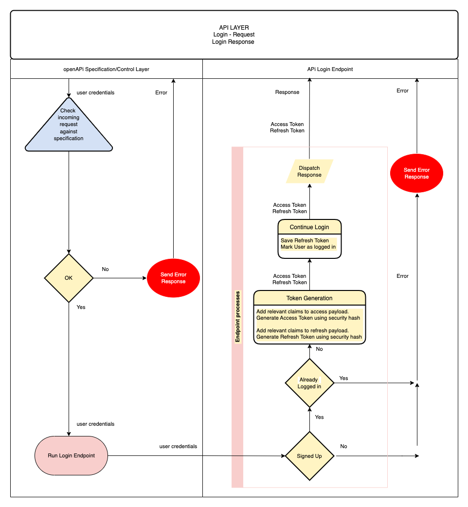
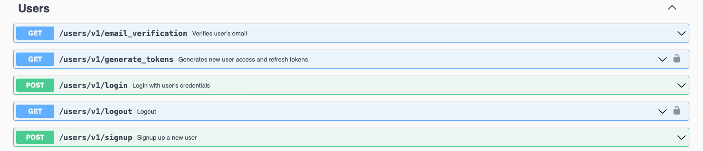
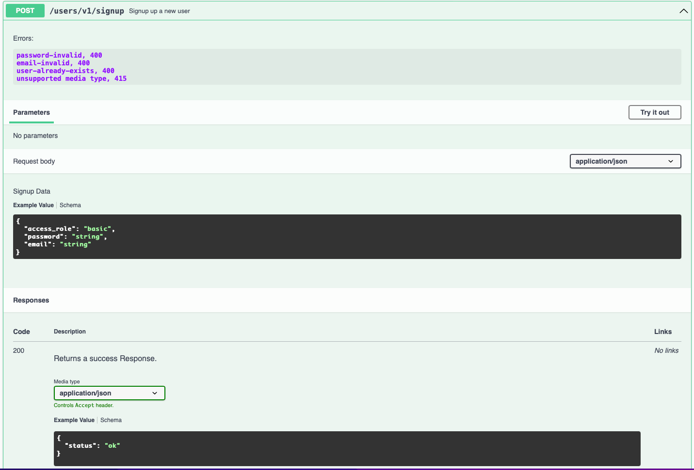
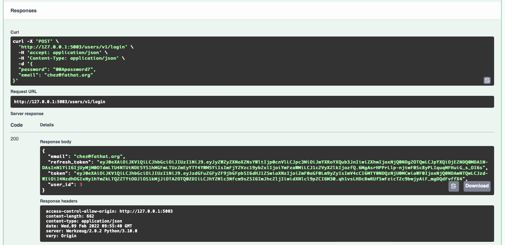
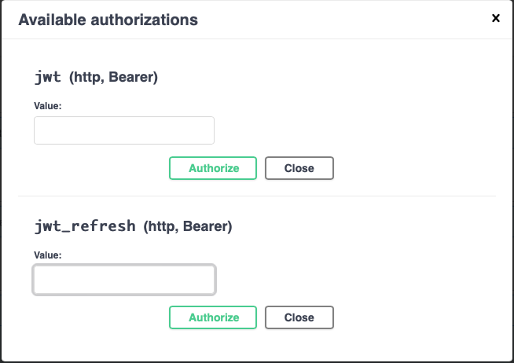

# starwars-api-backend-skeleton

---

### Backend API Learning Workflow:

---
### Stage-5:
<span style="color:#FF1B55FF">Users</span>

#### Introduction: 

In this section we shall add some user functionality to our API. Adding users will allow us to
facilitate our Authentication to the API. 

In the last section we ended with placing authentication requirements on our second films endpoint. 
As a consequence we could not use that endpoint without a JWT. In order to issue a JWT we require a 
a user of some form. Without users or the notion of a user there is no real way to facilitate authentication. 
Users and authentication go hand in hand.

Summary of objectives:

  * Add the required openAPI specifications for users.
  * Develop endpoints and data access for user signup,  login, logout and email verification
  * Develop the helper functions for user credentials and validation.
  * Develop MySQL database connectivity to store user data.
  * Add authorisation to user endpoints
  

<details>
<summary style="color:#4ba9cc">Introduction to Basic User Authentication</summary>

Before we look at the specifications for users let's first see what we require for a basic user strategy.

  * A Signup flow
    Obviously, in order to have users that are allowed access to private data, we need to sign them up.
    To signup you need some way of identifying a user, username or email or other ID. You also need a gateway
    security mechanism, i.e. for us it's a password. In some other systems it might be face id or fingerprint detection,
    palm prints, retina scanning etc. etc.

    The signup process is simply that signing up for a service. A signup flow should alway involve some form of verification
    A lot of services utilise email verification as one form of signup verification. This involves sending an
    email with a verification link to the provided email address. 

  * A Login flow 
    Once signup is complete, including verification, users are then able to login to access a system or service.
    Our example of the login process for our authenticated API access was already described in the 
    'Understanding the Authentication Flow'. Here it is again...



This is the flow that we shall create for our users login process. Once the user receives their access and refresh tokens 
The user or client on behalf of the user is responsible for storing those tokens safely. 

Thereafter, each call to a protected endpoint shall require a token.

  * A logout flow
    Logging out of our system requires a valid token to access the logout endpoint. The logout event itself must ensure that any
    user tokens issued to the user at the last login event must be revoked , meaning they no longer usable for access to any secured
    endpoint on our API.

    Once a logout event occurs, the user has to login again and receive new tokens for access.

The above represent the core of user account fundamentals. However, there's some extra functionality we need to consider.

Apart from the email verification flow, we need to consider what happens when tokens expire or get lost or become exposed.
What we do not want is to issue short-lived tokens and force our users to have to frequently login each time their token expires.

There are a couple of possible solutions here. First, we could issue long-lived tokens, say several days or more, and secondly we can implement a framework such that when a 
client/user understands that the user's token has expired they can ask our API to issue new tokens without the user being logged out. The second of these options is the one we'll use in our application. However, it is important to remember
that it is upto the client to ask for those new tokens and not just to send them after a token has expired.

</details>
       
<details>
<summary style="color:#4ba9cc">openAPI Specifications</summary>

Now we have our understanding of the basic user authentication flows, let's start to build our openAPI specification for users.

First up let's get our three basic user endpoint requests dealt with, signup, login and logout, shown below.

#### Signup

```yaml
/users/v1/signup:
    post:
      summary: Signup up a new user
      tags:
        - Users
      description: >
        
        Errors:
        
            password-invalid, 400
            email-invalid, 400
            user-already-exists, 400
            unsupported media type, 415

      operationId: users.v1.endpoints.signup
      requestBody:
        description: Signup Data
        content:
          application/json:
            schema:
              $ref: '#/components/schemas/UserSignup'

      responses:
        '200':
          description: Returns a success Response.
          content:
            application/json:
              schema:
                $ref: '#/components/schemas/SuccessResponse'
```

As we can see from first glance, the endpoint specification looks very similar to our other endpoint specifications.
However, the key differences here are:

  * The signup endpoint is a 'POST' endpoint because it is going to save some user information to our database.
  * The client/user sends user data in the request body as is standard practise with 'POST' requests and not in the query.
  * Our request body uses a schema to identify the structure of the user data that is sent. The user data in the request 
    body will be a set of credentials, email, password and an access role, which shall be defined in a schema. We'll get
    to that after we deal with the requests.

Other than the above it's pretty much the same. The endpoint function is pointed to by the 'operationId' and as usual, 'connexion'
is the interface between this specification and our API endpoints.

Our response is a simple success response, again we'll get to that after requests.

#### login
```yaml
  /users/v1/login:
    post:
      summary: Login with user's credentials
      tags:
        - Users
      description: >
        
        Errors:
        
            not-found, 404
            password-invalid, 400
            email-invalid, 400
            account-disabled, 400

      operationId: users.v1.endpoints.login
      requestBody:
        description: Login Data
        content:
          application/json:
            schema:
              $ref: '#/components/schemas/Credentials'

      responses:
        '200':
          description: Returns a JWT
          content:
            application/json:
              schema:
                $ref: '#/components/schemas/UserLoginResponse'

```

The login request is very similar but without the access role in the request body.
We define a response schema called 'UserLoginResponse' for detailing the structure of the response
which will include the user tokens created during the login flow.

#### logout

```yaml
  /users/v1/logout:
    post:
      summary: Logout
      tags:
        - Users
      description: >

        Required Headers:

          Authorization request header

            Bearer Valid Token

        Errors:

            'token-invalid', 401
            'authorisation-required', 401
            'User NOT logged out - problem accessing token in request', 400

      operationId: users.v1.endpoints.logout
      responses:
        '200':
          description: Returns 'ok' or an Error
          content:
            application/json:
              schema:
                $ref: '#/components/schemas/SuccessResponse'

      security:
        - jwt: []
```
The logout request has no incoming data specified, although it is a secured endpoint request
as can be seen from teh security tag at the bottom. Therefore, there is incoming data in the 
form of a token in the request header as per the Security specification schema that we put
in place whilst building our authentication.

>A quick reminder

```yaml
securitySchemes:
    jwt:
      type: http
      scheme: bearer
      bearerFormat: JWT
      x-bearerInfoFunc: auth.endpoints.decode_token
    
    jwt_refresh:
      type: http
      scheme: bearer
      bearerFormat: JWT
      x-bearerInfoFunc: auth.endpoints.decode_refresh_token
```

#### Email verification

```yaml
/users/v1/email_verification:
    get:
      summary: Verifies user's email
      tags:
        - Users
      description: >

          Verifies user's email using an email-token generated when signing-up the user

          Errors:

              'token-invalid', 401
              'authorisation-required', 401

              'user-not-found', 404

      operationId: users.v1.endpoints.email_verification
      parameters:
        - name: token
          description: Email verification token generated at sign-up time
          in: query
          required: true
          schema:
            type: string
      responses:
        '200':
          description: Returns OK
```

This request is interesting as it does not have security but it does carry a token in the query.
The request itself is made via na email link and not a normal client on a website. 
The token is one that was will be issued specifically via our API user signup endpoint. It is used
to confirm that the user we sent the email to is the actual endpoint requester. More of that when we
code our endpoints.

It responds with a straightforward http 200. Remember it's being requested from a link in an email.
so we don't need to pass any data back.

#### Generate tokens

```yaml
/users/v1/generate_tokens:
    get:
      summary: Generates new user access and refresh tokens
      tags:
        - Users
      description: >

        Required Headers:

          Authorization request header
            Bearer Valid Basic Access token

        Errors:

          'token-invalid', 401
          'authorisation-required', 401
          'user-not-found', 404

      operationId: users.v1.endpoints.generate_new_tokens
      parameters:
        - name: old_access_token
          description: The old access token of the user
          in: query
          required: true
          schema:
            type: string
      responses:
        '200':
          description: Returns a new access token (token) and a new refresh token (refresh_token)
          content:
            application/json:
              schema:
                 $ref: '#/components/schemas/UserTokens'

      security:
        - jwt_refresh: []

```

Our final endpoint for users is the generated tokens endpoint above. This endpoint is called 
with a user's legitimate refresh_token to generate a new access token and a new refresh token.

It can be called as described earlier when a user's access token has expired and the client application
does not want the user to have to login again. It's a convienient way of allowing login continuation.

The users old access token is passed in as a parameter in the query. This old token along with the  
refresh token that is used for authentication will be revoked after the new tokens have been generated.
It is up to the client to ensure that the old user tokens are discarded on their side as they are no longer valid.

The response is a vanilla 'UserTokens' schema.

>Copy the above request specifications to the openapi.yaml file in our root directory. remember to stick theme
in the right place, i.e. where the requests go and before 'components'

### User Schemas

Now that we have our endpoints let's look at the required schemas for both requests and responses.

We'll start with the request schemas. Note, that when ever you see a 'required' definition it implies that
the schema property is required else the response will be invalid.

```yaml
# -----------------------------------------------
#  User REQUEST SCHEMA
# -----------------------------------------------

UserID:
  required:
    - user_id
  properties:
    user_id:
      type: integer
      description: User ID

User:
  allOf:
    - $ref: '#/components/schemas/Email'
    - $ref: '#/components/schemas/UserID'
      
UserSignup:
  allOf:
    - $ref: '#/components/schemas/AccessRole'
    - $ref: '#/components/schemas/Credentials'

AccessRole:
  properties:
    access_role:
      description: Access role of user
      type: string
      enum:
        - admin
        - basic
      default: basic

Credentials:
      type: object
      allOf:
        - $ref: '#/components/schemas/Password'
        - $ref: '#/components/schemas/Email'
```

The first schema above specifies a user id. This is individual because it is used by other schemas, such 
as the one below it the 'User' schema. It's always a good idea to reuse as much as possible rather than create
the same thing in different places. That is a general rule for software development. 

We have a simple 'UserSignup' Schema that uses two other schema references, which you can see 
below it.

The 'AccessRole' schema dictates a basic choice via an enumerated set of two options, basic and admin.
These being the only choices that the endpoints will allow for access roles.

>Note: In this project we shall only be using the 'basic' access role.

The 'Credentials' schema uses two other schemas for password and email. We will look at those next.

### Password and Email Schemas 

```yaml
Email:
  required:
    - email
  properties:
    email:
      description: Email Address
      type: string
      pattern: ([-!#-'*+/-9=?A-Z^-~]+(\.[-!#-'*+/-9=?A-Z^-~]+)*|"([]!#-[^-~ \t]|(\\[\t -~]))+")@[0-9A-Za-z]([0-9A-Za-z-]{0,61}[0-9A-Za-z])?(\.[0-9A-Za-z]([0-9A-Za-z-]{0,61}[0-9A-Za-z])?)+

Password:
  required:
    - password
  properties:
    password:
      description: Password
      type: string
      pattern: (?=\S{8,32})(?=\S*[A-Z])(?=\S*[a-z])(?=\S*[0-9])(?=\S*)(?<!\S)\S{8,32}(?=\s|\Z)
```
These two schemas are interesting because they dictate a pattern for how the parameter should
be written (syntax validation). The patterns are what are known as regex patterns. Regex (Regular Expressions) are used
as a sort of shorthand notation to verify parameter structure. It takes a while to get used to writing regex but it is
worth looking into further as it is widely used by developers, especially for pattern verification as in this example.

You're lucky this time around, as you can see, you don't have to write the patterns, they are there.

In short these two schemas verify that any email addresses and passwords sent in requests are syntatically
valid.

>For more on regular expressions click the following link 
[Using Regex in Python](https://www.w3schools.com/python/python_regex.asp)

We then have our UserLoginResponse schema.

```yaml
UserLoginResponse:
    type: object
    allOf:
    - $ref: '#/components/schemas/UserTokens'
    - $ref: '#/components/schemas/User'
```

The UserLoginResponse is the response schema for our login request. It return the user tokens and the User, which comprises id and email.

#### User token response
```yaml
# -----------------------------------------------
#  AUTH TOKEN RESPONSE SCHEMAS
# -----------------------------------------------

UserTokens:
  type: object
  required:
    - token
    - refresh_token
  properties:
    token:
      type: string
      format: byte
      description: User's api calls token
    refresh_token:
      type: string
      format: byte
      description: User's refresh token
```
The above schemas represent the tokens. Each token is of type string but of format byte.
The format byte declaration ensures the string token is base64 encoded. It does this to make
the token fit nicely into the transfer protocol of http.


>For more on Base64 encoding you click the following link
[Base64 Encoding](https://www.base64encoder.io/learn/)

Our last schema is a simple success response, whic indicates the request was successful and is generally used if 
all we require is to tell the client that the status is ok such as we do with our signup and logout responses.

```yaml

StatusOk:
      type: string
      description: Api call success
      default: ok
      
SuccessResponse:
  type: object
  properties:
    status:
      $ref: '#/components/schemas/StatusOk'
```
That's it for our users openAPI specifications.
>Copy all the above schemas to the 'Schemas' section of the openapi.yaml file.

</details>

<details>
<summary style="color:#4ba9cc">Endpoints</summary>

Most of the user endpoints are small on code and straightforward. The meat and potatoes
is in the user data access layer.

Let's start with endpoint imports

```python
# -*- coding: utf-8 -*-

# ----------------------------
# Python Imports
# ----------------------------

# ----------------------------
# Module Imports
# ----------------------------
from users.v1.data_access import *
from auth.core import permission, verify_email_token, revoke_auth_token
from auth.utils import *
from basehandler import api_response
from errors.v1.handlers import *

# ----------------------------
# User Data Access layer
# ----------------------------
from data_access import UserDacc


```
We are importing are data access, authorisation, some utilities for preparing and checking passwords (section User Password Encryption/Decryption)
our Api response handler and error handling.

>Copy the code an dplace it in the users/v1/endpoints.py file

Let's get on with our endpoint functions

#### signup

```python
# -----------------------------
#     REST FUNCTIONS
# -----------------------------

def signup(**kwargs: dict):
    """
        Signup a user

        Verify the signup
        Not Ok = abort and return

    :param kwargs:
    :return: user entity
    :errors:
        ApiError
        "invalid" 400
        "invalid" 400
    """
    data = kwargs['body']

    pwd = prep_password(data['password'])

    # Swap the password in data for the hashed one
    data['password'] = pwd
    UserDacc.signup(data)

    return api_response()

```

The signup endpoint receives data in the form of an email, password and access role contained in the request body. If the endpoint is called, you can be sure
that the data is there.

It then prepares the password. This entails taking the password from the user and encrypting it using some for of  algorithm. We'll get to that soon.
It then calls the 'create' method from the data access layer class UserDacc. If this returns without an API error, it returns a reponse, which will be a http 200.

>Copy this code to the user endpoints file at users/v1/endpoints.py after the imports.

#### login 

```python

def login(**kwargs: dict) -> dict:
    """
        Attempts login with users credentials, email and password

    :param kwargs:
           email:
           password:

    :return: Token, Refresh token and user entity
    :errors:

        ApiError
            error_msg from password validation 401
            "user-unknown" 400

        "user-forbidden" 400
        "email-unverified", 400
    """

    auth = kwargs['body']
    email = auth['email'].lower()
    password = auth['password']

    uid, token, refresh_token = UserDacc.login(email, password)
    return api_response({'token': token, 'refresh_token': refresh_token, 'user_id': uid, 'email': email})

```

The login Function takes two parameters, password and email from the body of the request.
It calls the login method of the UserDacc class and gets a user object a normal access token and a refresh token.

We then pass those return values back in our response.

>Copy this code to the user endpoints file at users/v1/endpoints.py after the imports.

#### logout 

```python
def logout(**kwargs: dict):
    """
        Logout:
            Log the user out

        NOTE:
        The access token is not available in the token_info passed via connexion, thus we have to extract it from the
        request headers and append it to the token_ifo in the kwargs.

    :param kwargs:
    :return:
    """

    if 'Authorization' in request.headers:

        # Extract auth data from the authentication header
        auth_data = request.headers['Authorization'].encode('ascii', 'ignore').decode('ascii')

        # Check there is a Bearer token
        if 'Bearer ' in auth_data:
            token = auth_data.replace('Bearer ', '')
            kwargs['token_info']['token'] = token

            permission(kwargs['token_info'], access_role='basic', logout=True)
            UserDacc.logout(kwargs['token_info']['user_id'])
            return api_response()
        else:
            raise ApiError(message="Authorisation required", status_code=400)

    raise ApiError(message="User NOT logged out", status_code=400)

```

The logout endpoint is slightly more complicated in as much as we are accessing the  request headers 
to get the token. 

The endpoint requires authentication with a token, but unlike other endpoints we need access to the token
so that we can revoke it, i.e. store it our 'Redis' database.

The token is sent in the request header in 'Authorisation'.

How it works:

  * Check to see if there is any 'Authorization' in the request header.
    If there is continue else raise an APi error.
  * Extract the authorization header data into the variable auth_data
  * Check to see if there is a 'Bearer' tag in there.
    If there is continue else raise an API error.
  * Extract the token from the 'Bearer'.
  * Add the token to the kwargs token_info dictionary
  * call the 'permission' function from our authentication core with logout=True
    This will do the usual payload verification plus, because logout=True, it will 
    revoke the token.
  * Call the data access function 'logout'
    This just sets the user logged_in status to 0/False.
  * Return a response - default http 200

>Copy this code to the user endpoints file at users/v1/endpoints.py after the imports.

#### Email email_verification

```python
def email_verification(**kwargs: dict):
    """
        Attempts to verify an email via the email token

    :param kwargs:
    :return: SuccessResponse
    :errors:
        'authorisation-required' 401
    """
    try:
        payload = verify_email_token(kwargs['token'])
        UserDacc.verify_email(payload['user_id'], payload['email_claim'])
        revoke_auth_token(kwargs['token'])
        return api_response()
    except Exception:
        raise ApiError('authorisation-required', status_code=401)
```

Our email verification endpoint is called via a verification email that our API sends out during the signup process.

It is not a secured endpoint from the openAPI end, instead it carries an email token parameter that was included in the email.

  * The token is passed to the 'verify_email_token' function in our authorization core which verifies the token is legitamte and
    returns the tokens payload. 
  * The payload user_id and email_claim, which is the user email, are sent to the data access method 'verify_email'. 
  * The token is revoked, so it can't be used again.
  * We send a standard API response - http 200

The whole block is wrapped in a try - except block which means if there is any error in the process it will
raise our API error - regardless of the type of exception.

>Copy this code to the user endpoints file at users/v1/endpoints.py after the imports.

#### generate_new_tokens

```python
def generate_new_tokens(**kwargs: dict) -> dict:
    """
        Generates new API usage and refresh tokens
        Generally when a client's access token has expired they can request a
        new set of tokens be generated as long as they have the correct unexpired
        refresh token.

    :param user_id: The ID of the user to generate new tokens for.
    :param kwargs:
    :return: tokens
    :errors:
        'unknown-user' 404
    """
    permission(kwargs['token_info'], access_role='basic')
    token, refresh_token = UserDacc.generate_new_tokens(kwargs['token_info']['user_id'], kwargs['old_access_token'])
    return api_response({'token': token, 'refresh_token': refresh_token, 'user': kwargs['token_info']['user_id']})
```

This endpoint is called to generate new user tokens. It requires a valid user refresh token for access, with a minimum access_role of basic
The old user access token is passed in kwargs (keyword arguments) so that it along with the user's existing refresh token can be revoked.
It returns a new access token and a new refresh token from the UserDacc method 'generate_new_tokens'
It then returns these new tokens along with the users id.

That's our user endpoints for now.

</details>

<details>
<summary style="color:#4ba9cc">Data Access Layer</summary>

The user data access layer UserDacc does all the heavy lifiting for users. As with all other data access layers
it's a class. 

Let's go through it function by function, but starting with the imports

#### Data Access Layer Imports 

```python

# -*- coding: utf-8 -*-

# ------------------------------------------------
#    Python Imports
# ------------------------------------------------
from datetime import datetime

# ------------------------------------------------
#    External Imports
# ------------------------------------------------

# ------------------------------------------------
#     Project Imports
# ------------------------------------------------
from errors.v1.handlers import ApiError
from auth.utils import check_password
from auth.core import generate_jwt, decode_access_token, revoke_auth_token
from database.mysql.db_utils import db_insert_update, db_query
from database.redis.rd_utils import redis_connection
from utils import send_email
```

The imports above provide everything needed to handle our token, database email sending and error handling requirements.

>Copy these to the file users/v1/data_access.py

Let's go through our data access layer functions one at a time. With the first one, we'll include the class definition.

```python
# ------------------------------------------------
#     Abstract User Data Access Layer
# ------------------------------------------------

class UserDacc(object):
    """
        Abstract User Data Access Class
    """
```
This is our UserDacc class declaration. All of the following methods/functions will sit in the class declaration

#### signup

```python
@staticmethod
def signup(data):
    """
        Create and save a new user

    :param data:
    :return:
    """
    # Check there is an existing user with the same email
    if UserDacc.user_exists_by_email(data['email']):
        raise ApiError(message="user-already-exists", status_code=400)

    sql = "INSERT INTO users (email, password, access_role, created, disabled, email_verified, logged_in) " \
          "VALUES (%s, %s, %s, %s, %s, %s, %s)"
    values = (data['email'], data['password'], data['access_role'], datetime.now(), 0, 0, 0)
    db_insert_update(sql, values)

    # Retrieve the newly created user and send verification email.
    user = UserDacc.get_by_email(data['email'])
    UserDacc.send_verification_email(user)
```

The 'create' method is called from the 'signup' endpoint which passes the user credentials and access_role in the parameter 'data'.

What it does:

  * Checks to see if a user already exists with the same email.
    If it does then an APi error is raised.

  * Creates a simple sql statement with an accompanying values tuple of the user data and some extra values:

     1. created - A current date stamp,
     2. disabled - integer 0, that indicates the user is not disabled on creation. 
     3. email_verified - integer 0, that indciates the email is not verified on creation.
     4. logged_in - integer 0, that indicates that the user is not logged in on creation.
     
  * Calls the 'db_insert_update; database helper function to insert the user into the database.
  * Retrieves the newly created user by it's email address
  * Forwards the user to the method 'send_verification_email'

#### login

```python
@staticmethod
def login(email: str, password: str):
    """

    :param email:
    :param password:
    :return:
    """
    try:
        user = UserDacc.get_by_credentials(email, password)
    except Exception as e:
        raise ApiError(message="not-found", status_code=404)

    if user['logged_in']:
        raise ApiError(message="user-already-logged-in", status_code=400)

    if not user['disabled']:

        if user['email_verified']:

            # Generate new access and refresh tokens
            token, refresh_token = UserDacc.generate_new_tokens(user['id'])

            # Update the record to state user logged in
            sql = "UPDATE users SET logged_in = %s WHERE id = %s"
            db_insert_update(sql, (1, user['id']))
            return user['id'], token, refresh_token
        else:
            raise ApiError(message="email-unverified", status_code=400)

    else:
        raise ApiError(message="User Account Disabled", status_code=400)
```

Login is straightforward

  * get user from the credentials (email, password)
    if no user raise an API error
  * if user already logged in raise an API error
  * if user account is disabled raise an API error
  * if user's email is not verified raise an API error or if it is verified do the following:

    * generate a new access and refresh tokens 
    * update the user's logged in status
    * return the user id, email and tokens 

#### logout 

```python
@staticmethod
def logout(user_id: str):
    """

    :param user_id:
    :return:
    """
    sql = "UPDATE users SET logged_in = %s WHERE id = %s"
    db_insert_update(sql, (0, user_id))
```
Real simple, most of the woirk is done in the endpoint and auth. Here we just touch the database 
by setting the user's logged in status to 0, i.e. not logged in

#### Helper functions

The following are a set of helper functions for users. You should be able to work out what each one is doing.
Check each function carefully.

```python
@staticmethod
def get_by_credentials(email, password):
    """
        Fetch a user's entity via credentials

    :param email: User's email
    :param password: User's password
    :return: User's Entity

    :errors:
        'user-not-found', 404
    """
    user = UserDacc.get_by_email(email)

    if check_password(password, user['password']):
        return user
    else:
        raise ApiError(message='forbidden', status_code=403)

@staticmethod
def get_by_email(email: str) -> dict:
    """
        Fetch a user's entity by email address

    :param email: User's email
    :return: User's Entity

    :errors:
        'user-not-found', 404
    """
    sql = "SELECT * FROM users WHERE email = %s"
    values = (email,)
    user = db_query(sql, values)[0]

    if user:
        return user

    raise ApiError(message='user-not-found', status_code=404)

@staticmethod
def user_exists_by_email(email: str) -> bool:
    """
        Returns True if there is an existing user with the given email address

    :param email: User's email
    :return: True iff the user with email exists
    """
    sql = "SELECT id FROM users WHERE email = %s"
    values = (email,)
    return len(db_query(sql, values)) > 0

@staticmethod
def user_exists_by_id(user_id) -> bool:
    """
        Returns True if there is an existing user with the given ID
    :param email: User ID to check if exists
    :return: True iff the user with given ID exists
    """
    sql = "SELECT id FROM users WHERE id = %s"
    values = (user_id,)
    return len(db_query(sql, values)) > 0

@staticmethod
def get_by_id(id) -> dict:
    """
        Fetch a user's entity by ID

    :param id: User's ID
    :return: User's Entity

    :errors:
        'user-not-found', 404
    """
    sql = "SELECT * FROM users WHERE id = %s"
    values = (str(id),)
    user = db_query(sql, values)[0]

    if user:
        return user

    raise ApiError(message='user-not-found', status_code=404)

```

#### send_verification_email

```python
@staticmethod
def send_verification_email(user: dict):
    """
        Sends verification email to the given user.

    :param user: User to send the email.
    """
    token = UserDacc.get_token(user_id=user['id'], access_role=user['access_role'], payload_claim={'email_claim': user['email']})

    params = {'token': token}
    verification_url = f"{request.url_root}users/v1/email_verification?" + urllib.parse.urlencode(params)

    message_body = f"""Please verify account for {user['email']} by clicking on the following link:
        {verification_url}
        """

    try:
        send_email(user['email'], "Please verify account", message_body)
    except Exception as e:
        raise ApiError(message="verification-email-not-sent", status_code=500)

```

This sends the verification email to the provided email address. 

What it does:

  * Generates an email token
    Remember, we use different tokens for different tasks
  * Builds a url which becomes a clickable url/link in the email. This url contains the url  path and the token as a query parameter
  * Builds the message body of the email which includes the url
  * Attempts to send the email via the 'send_email' function in our utils.py file which is in the root directory.
    If it cannot send the email it raises an API error with message 'verification-email-not-sent'. This would then give the client/user
    a chance to resend the verification email via a 'resend_verification_email' endpoint.

#### verify_email

```python
@staticmethod
def verify_email(user_id, user_email: str):
    """
        Verifies the email of the given user by id

    :param user_id ID of the user
    :param user_email:
    :return: True if the user's email has been verified, or False otherwise
    :errors:
        'user-not-found', 404
    """
    user = UserDacc.get_by_id(user_id)

    # Check if the token contains the current email of the user.
    if user["email"] != user_email:
        raise ApiError(message="token-invalid", status_code=401)

    sql = "UPDATE users SET email_verified = 1 WHERE id = %s"

    db_insert_update(sql, (user_id,))

```

This is called via the 'email_verification' endpoint and performs two tasks

 * Checks the email is associated with a user with the id user_id
 * Marks the user's database record with email_verified set to 1/True

 It raises an API error if there is no match for the user's email.

#### get_token 

```python
@staticmethod
def get_token(**kwargs: dict) -> str:
    """
        Create a token and return

    :param user_id:
    :param kwargs:
    :return:
    """
    return generate_jwt(**kwargs)

```

This function passes a dictionary of keyword arguments in the form of:

    {user_id=x, access_role=y, payload=payload_claims}

to the 'generate_jwt' function in our authentication code

#### generate_new_tokens

```python
@staticmethod
def generate_new_tokens(uid: int, old_access_token=False) -> tuple:
    """
        Generate a new standard token and a new refresh token.

    :param uid: User's ID to generate new tokens for passed from client
    :param old_access_token: The old access token to be revoked.
    """
    try:

        if old_access_token:
            try:
                old_token_payload = decode_access_token(old_access_token)
                revoke_auth_token(old_access_token)
            except ApiError as e:
                if e.message == 'token-invalid':
                    raise e
            if old_token_payload['user_id'] != uid:
                raise ApiError(message='token-invalid', status_code=403)

        user = UserDacc.get_by_id(uid)

        if user['refresh_token']:
            # Add the old refresh token to some kind of cache (In this case Redis) so
            # that we can fail the token in authorisation if it has not yet expired.
            redis_connection.set(user['refresh_token'])

        token = UserDacc.get_token(user_id=uid, access_role=user['access_role'], payload_claim={'standard_claim': True})
        refresh_token = UserDacc.get_token(user_id=uid, access_role=user['access_role'], payload_claim={'refresh_claim': True})

        # Save the new refresh token to the user's database row.
        sql = "UPDATE users SET refresh_token = %s WHERE id = %s"
        db_insert_update(sql, (refresh_token, user['id']))

        return token, refresh_token

    except Exception as e:
        raise e
```

This function generates a new access and refresh token and returns both. It has two parameters:

  1. uid - A user id
  2. old_access_token (Optional) - The old access token of the user with user id.

What it does:

  * If there is an old access token then:
      * decode the token and get its payload
      * revoke the old token so it cannot be used again
      * Check the user id in the payload is the same as the uid passed in.
        If it is not then raise an API error

 * Fetch the user's record from the database
 * If the user has an existing refresh token the add it to our revoked tokens in the 'Redis' database.
 * Generate the new access and refresh tokens
 * Save the new refresh token to the user's record in the database 
 * Return the new tokens 

As can be seen the whole function is wrapped in a try, except block.

>Copy all of the above data access functions to the class UserDacc in users/v1/data_access.py.

Before we move on let's just add our 'send_email' function to our utilities file utils.py in the route directory.
Then we'll add the appropriate mail server configuration to our config/v1/app_config.py file.

```python
def send_email(receiver_email, subject, message_body):
    """
        Sends a plain-text email to receiver_email address with
        subject and message body

    :param receiver_email Email address of the receiver (To)
    :param subject Subject field of the email
    :param message_body Body of the email.
    """
    message = f"""\
    Subject: {subject}

    {message_body}."""

    context = ssl.create_default_context()
    with smtplib.SMTP_SSL(SMTP['host'], SMTP['port'], context=context) as server:
        server.login(SMTP['sender_email'], SMTP['sender_password'])
        server.sendmail(SMTP['sender_email'], receiver_email, message)
```

This function creates an SMTP (Simple Mail Transfer Protocol) is a method for sending emails. in our function we send
set up an smtp server. login to the server and send the email. 

>Copy this code to utils.py and then copy the following configuration code to the 
config/v1/app_config.py file and we should be good to go.

```python
# Parameters to connect to the SMTP server for sending emails.
# TODO: Use a different account than "tayfun@" only for automated emails.
SMTP = {
    "host": "mail.privateemail.com",
    "port": 465,
    "sender_email": "tayfun@fathat.org",
    "sender_password": "Soxpoq-joxku9-kajgot"
}
```


</details>

<details>
<summary style="color:#4ba9cc">User Password Encryption/Decryption</summary>

Now we'll jump back to our authentication code base under auth.

We have two functions here, one for encypting a plain text password 'prep_password', the other for checking 
a plain text password against the encypted password, 'check_password'.

These are the only two functions required for handling our password encyption and checking.

The following code includes the functions and imports. 

>Copy this code to the auth/utils.py file

```python

# -*- coding: utf-8 -*-
# ------------------------------
#  Python Imports
# ------------------------------

# ------------------------------
#  External Imports
# ------------------------------
from argon2 import PasswordHasher
from argon2.exceptions import InvalidHash as Argon2InvalidHash, VerificationError as Argon2VerificationError

# ------------------------------
#  Module Import
# ------------------------------


# ------------------------------------------------
#     Auth Utility Functions
# ------------------------------------------------

def prep_password(password: str):
    """
        Hashes a password
        Password is validated via openapi spec

    :param password:
    :return: Hashed password
    """
    return PasswordHasher().hash(password)


def check_password(password: str, password_hash: str) -> bool:
    """
        Check a password

    :param password:
    :param password_hash:
    :return:
    """
    try:
        return PasswordHasher().verify(password_hash, password)
    except (Argon2VerificationError, Argon2InvalidHash):
        return False

```

The encyption algorithm is inside the imported package argon2. Argon2 is one of the best encryption methods out here.
As you can see we use the internal argon2 password hasher to create and verify our encypted passwords.

For more information on Argon2 see:

[Argon2](https://en.wikipedia.org/wiki/Argon2)

</details>

<details>
<summary style="color:#4ba9cc">MySql database connectivity</summary>

Before we can use our user endpoints we have to do a bit of work on talking to our database. 
remember, we have already setup our MySQL database but we have not yet introduced the code to 
interact with it. Let's do that now.

### MySQL database Connection and helper functions


#### imports

```python
# -*- coding: utf-8 -*-

# ------------------------------------------------
#    External imports
# ------------------------------------------------
from mysql.connector import connect
from mysql.connector.errors import IntegrityError

# ------------------------------------------------
#    Python Imports
# ------------------------------------------------

# ------------------------------------------------
#    Module Imports
# ------------------------------------------------
from errors.v1.handlers import ApiError
from config.v1.app_config import MYSQL

```
Importing from the mysql python package, our API error handling and some configuration data
>Copy the above imports into the file database/mysql/db_utils.py 

#### Connecting to the database

```python
# ------------------------------------------------
#     Database Connection
# ------------------------------------------------

def db_connect() -> tuple:
    """
        Connects to our database

    :return:
    """

    try:
        return connect(
            host=MYSQL["host"],
            user=MYSQL["user"],
            password=MYSQL["password"],
            database=MYSQL["database"]
            )

    except Exception as e:
        # We could use an HTTP error status code of 500 or 503
        raise ApiError(message="Database Connection Error", status_code=503)

```
The connection function uses data from our configuration file to connect with the database.

### Inserting and Updating 

```python
def db_insert_update(sql: str, values=None):
    """
        Calls sql on the database and
        returns the result.

    :param sql: The SQL INSERT statement
    :param values: The values to be inserted
    :return: The row ID
    """
    try:
        db = db_connect()
        with db.cursor() as cur:
            if values:
                cur.execute(sql, values)
            else:
                cur.execute(sql)
        db.commit()
        # If it's an INSERT Return the ID of the last row inserted
        if "INSERT" in sql:
            rid = cur.lastrowid
            db.close()
            return rid

    except IntegrityError as e:
        # Integrity Error normally evoked when a duplicate entry is attempted - i.e. same email address, password, etc.
        # Check Unique columns for the database
        raise ApiError(message=e.args[1], status_code=503)
    except Exception as e:
        if e.message == "Database Connection Error":
            message = "service unavailable"
        else:
            message = e.message

        raise ApiError(message=message, status_code=503)
```

This function inserts new records or updates existing records in the database.
It takes two parameters an SQL statement and a set of values.

What it does:

  * It makes a connection to the database by calling our connect function

  * It takes a cursor (a pointer into the database) and attempts to execute
    the sql statement with the accompanying values. 
    
    Note, it is the sql statement as can be seen from our user data access
    functions that determines if the operation is an insert or an update.

  * If the operation is an 'insert' it gets the id from the row we inserted (the last row),
    and returns it to the caller. 

Exceptions are handled in the 'except' part of the try except block that wraps the function.

### Querying the database 

```python
def db_query(sql: str, values: str):
    """
        Calls sql on the database and
        returns the result.
    :param sql: The SQL statement
    :param values: The values to be substituted in the SQL query
    :return:
    """

    try:
        db = db_connect()
        with db.cursor() as cur:
            # Extract row headers
            cur.execute(sql, values)
            # Collect the column names, i.e. headers
            headers = [x[0] for x in cur.description]
            return db_json_result(cur.fetchall(), headers)
    except Exception as e:
        if e.message == "Database Connection Error":
            message = "service unavailable"
        else:
            message = e.message
        raise ApiError(message=message, status_code=503)
```

The query function allows us to make queries on the database. It takes two parameters, an sql statement and an associated set of values

What it does:

  * Makes a connection
  * Gets a database cursor
  * Executes the query using the sql and values
  * Uses a list comprehension to the cursor description which holds the column names of the results
  * Calls the 'db_json_result' function below to convert the results (cur.fetchall() returns the results) with the column names, and convert
    to a json object/dictionary and then returns it to the caller.

#### Convert query results to Json

```python
def db_json_result(data, headers) -> list[dict]:
    json_data = []
    for result in data:
        try:
            json_data.append(dict(zip(headers, result)))
        except TypeError:
            json_data.append(dict(zip(headers, str(result))))
    return json_data

```
Simple function that takes the results of the query and the assoicated list of column names (headers) and
uses a dict with zip to associate the results and column names as key-value pairs in a dictionary.

That's it for our database functions for now.

>Copy all of the above functions to database/mysql/db_utils.py, as always after the imports.

Let's now setup the database table for our users.

### Setting up our user table

```python

# ------------------------------------------------
#    External imports
# ------------------------------------------------

# ------------------------------------------------
#    Python Imports
# ------------------------------------------------

# ------------------------------------------------
#    Module Imports
# ------------------------------------------------
from errors.v1.handlers import ApiError
from database.mysql.db_utils import db_connect


# ------------------------------------------------
#     Database TABLE CREATION functions
# ------------------------------------------------

def user_model():
    """
        Return the SQL statement to create the Users table

    :return: string containing MySql user table creation statement
    """
    return "(id int NOT NULL AUTO_INCREMENT, email VARCHAR(255), password VARCHAR(255), refresh_token VARCHAR(1024), " \
           "access_role VARCHAR(10), created DATETIME default now(), disabled BOOLEAN, email_verified BOOLEAN, logged_in BOOLEAN, " \
           "CONSTRAINT UC_user UNIQUE (id,email,password))"


def create_user_table(db_connection):
    """
        Create the user table for the database
    :param db_connection: The active connection to our database
    :return:
    """
    try:
        with db_connection.cursor() as cur:
            user = user_model()
            create_users = "CREATE TABLE users " + user
            cur.execute(create_users)
            db_connection.commit()
    except Exception as e:
        raise ApiError("User table creation error", 500)


# ------------------------------------------------
#     Setup the database
# ------------------------------------------------
connection = db_connect()
create_user_table(connection)

```
There are two functions that are required to setup our user table.
The 'user_model' function which outlines the columns for our table, their types, default values if any and extras like UNIQUE  CONSTRAINTS.

All this function does is return the model as a string. 

Note, it is common to call data structures models. A model defines the structure and detail of an objects details.
You will come across the term 'Model' in all aspects of software development.

The second function 'create_user_table' takes the user model and creates the table.

The two lines below the second function are our connection variable and a call to the 'create_user_table' function. Again

>Copy this code to the database/mysql/setup.py file and run it and see if we created our database.

</details>

<details>
<summary style="color:#4ba9cc">Testing</summary>

Let's test our user endpoints and see what happens.

Run the application again and remember to add the '/ui' after the url.

>Scroll dow to the user endpoints and you should see the following:



>Click on the 'signup' endpoint.



>Click on 'Try it out' and enter a valid email address and a password. 
Passwords should be between 8 and 32 characters long. Have a least one
upper case character and an integer. 

Leave the 'access_role' as it is 'basic'.

>Click the 'execute' button.

The response should be a '200' with an empty set of  curly braces '{}'

If your email is genuine, you should get an email verification email to that address. 
When you get it do not click the link yet. First let's attempt to login.

>Click the 'login' endpoint and click 'Try it out' and enter the same credentials you used to signup.
The response should be a '400' with the message 'email-unverified'.

>Now click the link in the email, that will call the endpoint 'email_verification'.

You should now be able to login.

>Click the 'execute' button again. The following response should appear, but obviously with different tokens and email addresses



>Copy the tokens to a note or text file somewhere. 

We are now logged in and have received our access and refresh tokens

Next go to the 'films' endpoint. Click it and click 'Try it out' and see what happens. 
You should recieve a '401' response with a message 'No authorization token provided'

That is beacuse we have not yet simulated the 'films' endpoint call with a token in the header as a client would.
To do that in our API interface we need to add the tokens to it.

At the top right of the screen you'll see the following button


>Click on that and the following popup will appear. 


    
Now get your tokens and place them in the relevant inpuyt fields, 
without the double quotations '"' marks at either end. 

>Click 'Authorize' for each and close the popup.

Now re-visit the 'films' endpoint and try again. You should see a '200' response and the 7 
Star Wars films data.

So that's how our user authentication on our endpoints is handled. We login, we get our tokens 
and can then call the appropriate endpoints which allow our level of access. Without the tokens,
you cannot get access.

</details>

<details>
<summary style="color:#4ba9cc">Exercise</summary>

The following four exercises fit nicely into what we have achieved already.

#### Exercise 1.

Test out all the new user endpoints. Figure out the purpose of the generate_new_tokens endpoint and what to do
after you have generated them. Have a good look over everything and then move on to exercise 2.

#### Exercise 2.

Add a resend_verification_email endpoint, including the openAPI Specification, the endpoint and data access code.

#### Exercise 3.

Add a user delete endpoint, including the openAPI Specification, the endpoint and data access code and a delete function for our database.

#### Exercise 4.

Add a user password change endpoint including the openAPI Specification, the endpoint and data access code.
</details>

>Once you're done with the above exercises you can move on to [<span style="color:#4ba9cc">Stage 6 - Introducing Testing</span>](stage-6.md)

